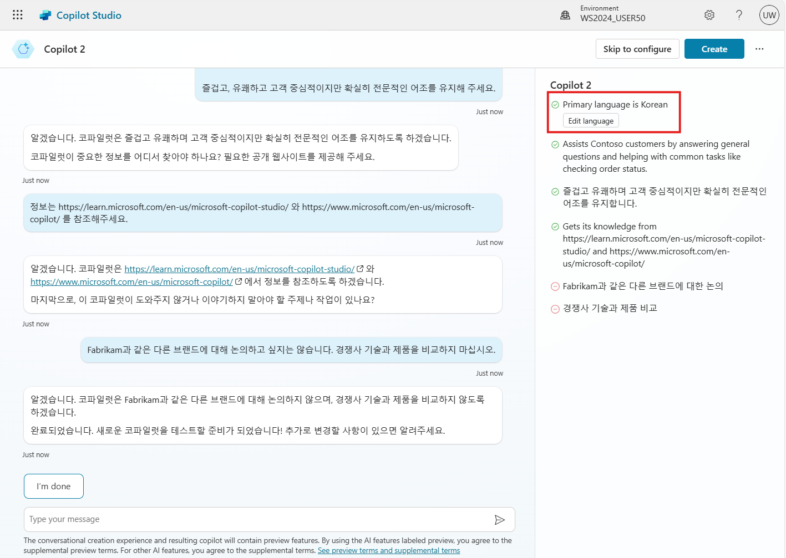

# 연습 1: 코파일럿 만들기를 위해 로그인하기

- 이 연습에서는 제공된 자격 증명을 사용하여 Microsoft Copilot Studio 작성 환경에 로그인합니다.

## 작업 1. 브라우저 환경 설정

  - 기존에 로그인한 경험과 충돌을 피하기 위해 다음 세 가지 옵션 중 하나를 사용하여 이 실습을 수행할 수 있습니다.

    1. **해당 워크숍에서 사용할 새 작업 프로필 설정**

          **Pro tip:** 작업 환경과 평가판 환경 간에 작업 기록을 
         유지하면서 전환하는 가장 좋은 옵션입니다. 나중에 계정을 계속 
         사용하려는 경우 이상적입니다.
       
       
       
    3. Or **게스트로 브라우징**

    4. Or **InPrivate 세션 시작**.

  - 브라우저의 언어를 영어로 설정해 줍니다. 
    (브라우저의 언어가 영어가 아닌경우, 일부 실습 진행이 어려운 부분이 있습니다.)

    


## 작업 2. Copilot Studio에 로그인하기

   1.  [aka.ms/CopilotStudioStart](https://aka.ms/CopilotStudioStart)로 이동

       ```
       https://aka.ms/CopilotStudioStart
       ```
    
   2. **제공된 사용자 이름을 입력하고 다음을 클릭**
       ```
       user??@5pv738.onmicrosoft.com
       ```
    
   3.  **Sign in 제공된 비밀번호를 입력하고 로그인 클릭**
    
   4.  메시지가 표시되면 로그인 상태를 유지할지 여부를 선택합니다.
    
        
  
   5. Microsoft Copilot Studio에 처음 액세스하면 국가/지역을 선택하라는
    메시지가 표시됩니다. 값을 선택하거나 기본 옵션을 그대로 두고 시작하기를
    클릭할 수 있습니다.

## 작업 3. 코파일럿 만들기

1.  Microsoft Copilot Studio 홈페이지에서 코파일럿을 설명하여 만듭니다.
    
    ```
    고객 지원을 위한 코파일럿을 원합니다.
    Contoso 고객을 위한 도우미로, 일반적인 질문에 답변하고 주문 상태 확인과 같은 일반적인 작업을 돕는데 도움이 됩니다
    ```

    

2.  부조종사를 추가로 사용자 지정할 수 있는 대화 환경으로 리디렉션됩니다. 설명에 대한 추가 세부 정보를 제공할 수 있으며(거부할 수 있음) 목소리 톤을 입력하라는 메시지도 표시됩니다.
  
    설명이 영어로 표현되는데, 한국어로 진행해 달라는 요청을 추가하면, 응답을 한국어로 해 줍니다.
    
    또한 앞으로의 실습을 최대한 한글로 진행하기 위해 코파일럿의 기본 언어는 한국어로 설정합니다. 

    ```
    한국어로 진행합니다.
    즐겁고, 유쾌하고 고객 중심적이지만 확실히 전문적인 어조를 유지해 주세요.
    ```

3.  **공개적으로 접근 가능한** 웹사이트를 정보 소스로 요청받습니다.
    
    ```
    정보는 https://learn.microsoft.com/en-us/microsoft-copilot-studio/ 와 https://www.microsoft.com/en-us/microsoft-copilot/ 를 참조해주세요.
    ```

4.  코파일럿이 도와주거나 논의하지 않아야 할 주제나 작업도 요청받습니다.
 
    ```
    Fabrikam과 같은 다른 브랜드에 대해 논의하고 싶지는 않습니다. 경쟁사 기술과 제품을 비교하지 마십시오.
    ```
    
    
5.  필요한 정보를 모두 입력하면 \"완료\"를 클릭합니다.

6.  코파일럿을 만들기 전에 "..." 및 "고급 설정 편집" 메뉴로 이동하여 코파일럿 스키마 이름을 업데이트합니다(코파일럿 표시 이름과 달리 스키마 이름은 나중에 변경할 수 없는 기술적 속성이므로 고유해야 함). 그리고 나중에 내보내고 솔루션 게시자 접두사에서 상속할 수 있도록 솔루션(예: "Copilot Studio Workshop")에 저장합니다.

      사용자 지정 코파일럿의 고유한 이름(표시 이름 및 스키마 이름 모두)을 선택해야 합니다


7. 그런 다음 \"생성\"을 선택할 수 있습니다.

   

   
   |    | 1.	"Skip to configure(구성으로 건너뛰기)"를 선택하여 대화 생성 환경을 피하도록 선택할 수 있습니다. <br>2. "언어 편집" 메뉴에서 조종사의 기본 언어를 설정할 수 있습니다. 랩의 경우 반드시 영어(en-US)로 유지하세요. <br> 3. 항상 자신의 솔루션과 게시자의 컨텍스트에서 코파일럿을 구성하는 것이 가장 좋습니다. 그러면 코파일럿이 원하는 게시자 접두사로 생성되고, 쉽게 내보내어 다른 환경에 배포할 수 있습니다.|   
   | --- | --- |
   
