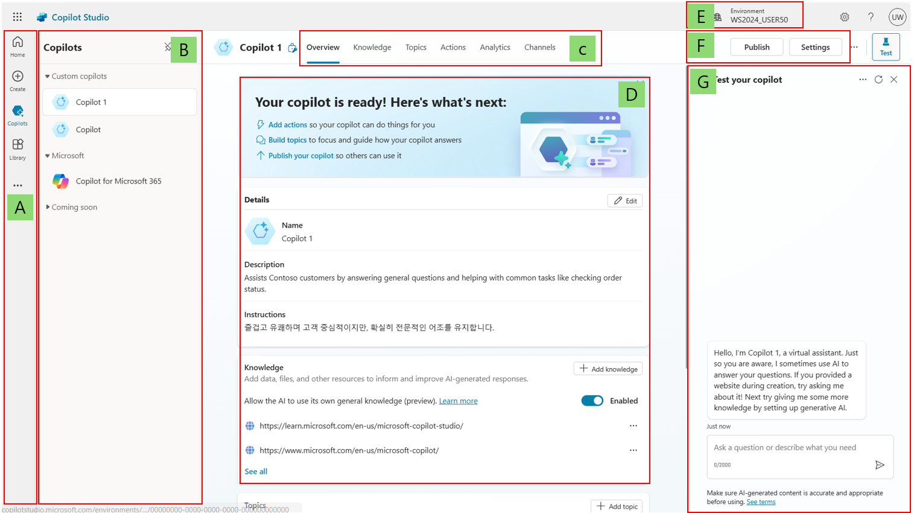
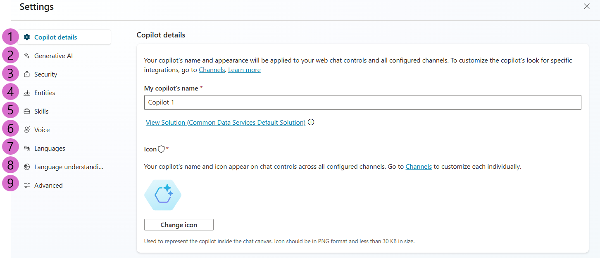

# 연습 2: 사용자 인터페이스 빠르게 둘러보기

- Microsoft Copilot Studio는 기본부터 고급 코파일럿을 쉽게 만들 수 있도록
도와줍니다. 이 섹션에서는 Microsoft Copilot Studio의 주요 페이지를
검토합니다.

## 메인 인터페이스

  

### A.
  - **Home :** Microsoft Copilot Studio 홈페이지를 표시합니다. 여기에서 새 코파일럿을 만들 수 있으며, 최근 코파일럿 목록, 템플릿 목록, 학습 자료 등이 포함되어 있습니다.
  
  - **Create :** 대화형 코파일럿 생성 경험으로 이동합니다.
   
  - **Copilots :** 사용자 환경에서 액세스할 수 있는 모든 코파일럿 목록을 표시합니다.
   
  - **Library :** Microsoft 1st-party 코파일럿 확장을 위한 커넥터 목록을 표시합니다.

### B. 
  - **Copilots :** 사용자가 맞춤 설정하고 빠르게 이동할 수 있는 코파일럿 목록.

   **Pro tip :** 단일 코파일럿 작업 시 코파일럿 목록 고정을 해제하여 작성 공간을 더 많이 확보할 수 있습니다.

### C. 
  - **Menu :**  가장 유용한 Copilot Studio 기능 간의 탭 탐색

  - **Overview :** 코파일럿 설명, 지침 및 구성(지식 소스, 주제, 작업, 게시 상태 등)을 빠르게 확인할 수 있습니다.
    
  - **Knowledge :** 코파일럿의 지식 소스(웹사이트, 파일 등)를 관리하는 곳입니다.
    
  - **Topic :** 사용자 정의 주제와 시스템 주제를 관리하는 곳입니다. 주제는
    코파일럿의 핵심 구성 요소로, 대화가 어떻게 진행되는지를 정의합니다.
    주제는 개별 대화 경로로, 함께 사용하면 자연스럽고 적절하게 흐르는 대화를 할 수 있습니다.
    
  - **Actions :** Action을 관리하는 곳입니다. Action은 입력과 출력을 가진 논리
    조각입니다. 커넥터, Power Platform 클라우드 흐름, AI Builder, 사용자
    정의 프롬프트 또는 Bot Framework 스킬과 같은 Power Platform 구성
    요소를 활용합니다. Action은 생성 AI를 활용하여 필요한 입력을 유도하고
    원하는 형식으로 작업 출력을 요약하는 데 유용합니다.
    
  - **Analytics :** 코파일럿이 사용자에게 얼마나 잘 제공되고 있는지 모니터링하고
    개선 방법을 식별할 수 있는 메트릭을 확인하는 곳입니다.
    
  - **Channels :** 사용자에게 코파일럿을 제공하는 방법을 구성하는 곳입니다(예: Teams, 웹사이트 등).

### D. 
  - **Overview :** Copilot 설명, 생성 AI 설명 및 구성(지식 소스, 주제, 작업, 게시 상태 등)을 빠르게 볼 수 있는 편집 가능

### E.  
  - **Environment :** 작업 중인 Power Platform 환경을 식별할 수 있는 곳입니다. 보통 개발 환경에서 코파일럿을 만들고 작성한 후 테스트 및 프로덕션 환경에 배포합니다.

### F.  
  - **Publish :** 최신 버전의 코파일럿을 사용자에게 제공할 수 있는 곳입니다.
   테스트 창 외에는 코파일럿을 게시하지 않으면 변경 사항이 최종
   사용자에게 반영되지 않습니다.

  - **Settings :** 코파일럿 구성(고급 설정, 보안, 언어 등)을 관리하는 곳입니다.

### G.  
  - **Test your copilot :** 테스트 창을 통해 저장할 필요 없이 즉시 코파일럿과 사용자 정의를 테스트할 수 있습니다.

## Settings interface 설정 인터페이스
   
   

### 1.  
  - **Copilot details :** 코파일럿 표시 이름,
       아이콘을 업데이트하고 고급 설정을 수정하는 곳입니다(예: Azure
       Application Insights 통합 구성).
   
### 2.   
  - **Generative AI :** 주제 트리거링 및 엔터티 추출을
       위한 더 고전적인 자연어 이해 접근 방식을 다중 의도 탐지 및 더 복잡한
       엔터티 추출을 수행하는 대형 언어 모델 기반 접근 방식으로 대체할 수
       있는 곳입니다. 또한, 지식 소스에 대한 콘텐츠 조정 설정을 구성하여
       환각 발생 위험을 줄일 수 있습니다.
   
### 3.  
  - **Security :** 다른 사용자와 코파일럿을 공유(공동 작성)하거나
       보안 그룹과 공유(사용)할 수 있는 곳입니다. 최종 사용자 인증
       설정(인증 유형 및 적용 여부) 및 웹 채널 보안도 구성할 수 있습니다.
       이를 통해 웹 또는 사용자 정의 애플리케이션 배포에 사용되는 Direct
       Line 채널을 더욱 안전하게 할 수 있습니다.
   
### 4.  
  - **Entities :** Copilot Studio에는 사용자 발화에서 주요
       정보를 식별하는 데 도움이 되는 많은 사전 구축된 엔터티가 포함되어
       있습니다(예: 도시, 날짜, 번호 등). 이 메뉴에서는 폐쇄형 목록 엔터티
       또는 정규식 엔터티를 정의할 수도 있습니다.
   
### 5.  
  - **Skills :** Copilot Studio 코파일럿이 호출할 수 있는 외부 Bot
       Framework 스킬을 등록하거나 기존 Azure Service Bot이 Copilot Studio
       코파일럿을 스킬로 사용할 수 있도록 구성하는 곳입니다.
   
### 6.  
  - **Voice :** 고급 음성 인식 및 듀얼 톤 다중 주파수(DTMF) 입력과 같은 음성 우선 기능 활성화. 전화 채널에서만 지원.
    
### 7.
  - **Languages :** 코파일럿을 사용할 수 있는 추가 언어를 구성하고 지역화할 수 있는 곳입니다.
   
### 8.  
  - **Language understanding  :** Azure Conversational
       Language Understanding(CLU)에서 Azure AI Language로 개발 및 훈련된
       사용자 정의 언어 모델을 구성할 수 있는 곳입니다. 구성된 경우, 이는
       의도 감지를 위한 기본 제공 자연어 이해 모델(NLU)을 효과적으로 대체할
       수 있으며, 엔터티 감지 및 추출도 대체할 수 있습니다.

### 9.
  - **Advanced :** Application Insights, Metadata, View solution 등 메뉴 
