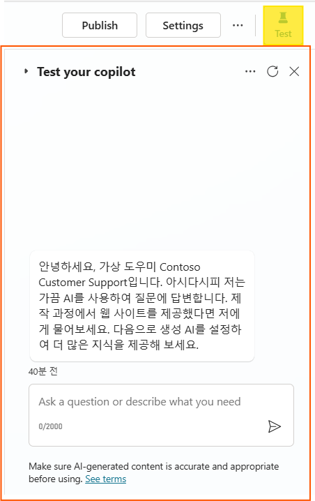
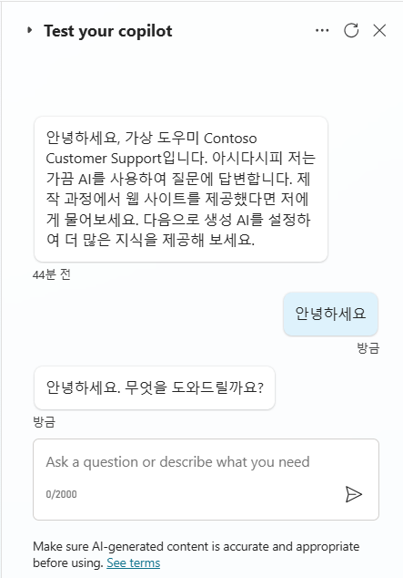
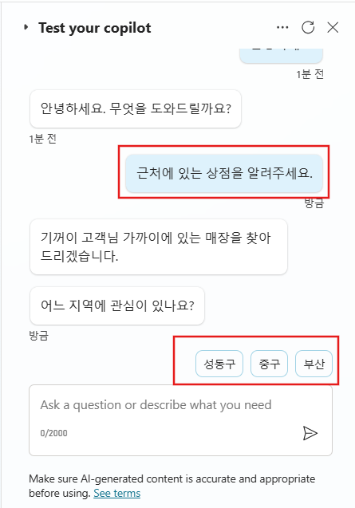
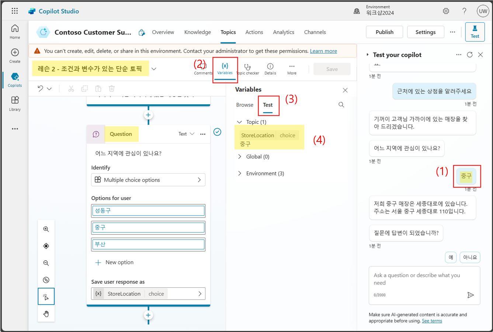

# 연습 3: 코파일럿 테스트하기

1. 화면 오른쪽 상단의 Test를 선택하여 테스트 코파일럿 창을 표시합니다.

   

2. 테스트 코파일럿 창에는 코파일럿으로부터 이미 메시지가 전송되었음을 보여줍니다. </br>
   이 메시지는 자동으로 시작되는 대화 시작 주제에서 전송되었습니다. </br>
   테스트 코파일럿 창 하단의 \"질문을 하거나 필요한 것을 설명하세요\" 프롬프트에 **\"안녕하세요\"** 를 입력하고 전송 버튼을 선택합니다.

   ```
   안녕하세요.
   ```

   

   코파일럿이 테스트 코파일럿 창에서 인사말을 제공합니다.

3.  테스트 코파일럿 창에 **\"근처에 있는 상점을 알려주세요.\"** 라는 메시지를 입력하고 전송 버튼을 선택합니다. </br>
    코파일럿의 사전 구축된 주제 중 하나(연습 2 - 조건과 변수를 가진 간단한 주제)가 트리거되며, 관심 있는 위치를 묻습니다.

    ```
    근처에 있는 상점을 알려주세요.
    ```

4.  테스트 채팅에서 원하는 상점 위치를 선택합니다. 코파일럿은 선택한 위치에 따라 특정 정보를 제공합니다.

     

     이제 기존 주제를 검토했으므로 다음 연습으로 넘어가 새 주제를 만들 수 있습니다.
    
      **Pro tip:** 테스트 창에서 메시지를 클릭하면 사용된 정확한 주제와 노드로 리디렉션됩니다.
     주제에 있을 때 변수 메뉴에서 변수 값을 확인할 수 있습니다 (예:선택한 상점 위치). 이 메뉴의 테스트 탭에서 실행 시 현재 값을   표시합니다.   

     
