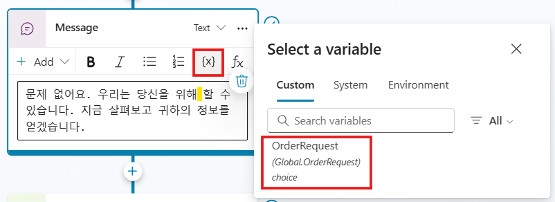

# 변수

이전 랩에서 만든 주제를 향상시키기 시작했습니다. 이전 섹션에서는
엔터티와 슬롯 채우기를 사용하여 사용자의 문장에서 데이터를 자동으로
감지하고 특정 데이터를 변수에 저장했습니다. 이제 질문에서 얻은 데이터를
변수에 사용한 다음 메시지 내에 표시하는 방법을 알아봅니다.

## 작업 1: 변수 유형에 대해 알아보기

변수를 사용하면 최종 사용자의 응답을 저장하여 대화를 안내하는 데 도움이 됩니다(예: 품목의 구매 가격에 따라 반품에 대해 다른 지침을 제공할지 여부 결정). 
또한 부조종사의 대화 응답에서 직접 사용할 수 있습니다(예: \"*{Topic.ProductName}을 반환하는 데 도움을 드릴 수 있습니다*.\").

기본적으로 변수가 생성된 항목에서만 변수 값을 사용할 수 있습니다. 
그러나 copilot이 다른 주제에서 동일한 값을 참조하도록 하려면 전역 변수로 만들도록 선택할 수 있습니다(다른 애플리케이션에서 이 개념을 알 수 있음).
기본적으로 대화가 다른 주제로 이동할 때 부조종사는 대화의 이전 주제에서 채워진 변수 값을 기억하고 사용할 수 있습니다. 
Microsoft Copilot Studio에서는 PowerFx 수식 및 함수를 사용하여 변수를 설정할 수 있으며, 변수 값 설정 노드를 사용하여 질문 노드 외부에서 변수를 설정할 수 있습니다.

Microsoft Copilot Studio의 다양한 유형의 변수는 다음과 같습니다.

-   **System** -- 이러한 변수는 일반적으로 시스템 데이터로 채워집니다.
    시스템 변수는 사용자가 만든 것이 아니며 플랫폼의 일부입니다. 예를 들어 부조종사에 최종 사용자 인증이 필요한 경우 시스템 변수에는 사용자 ID, 이메일, 이름 등이 포함될 수 있습니다. 
    시스템 아래의 변수 선택에서 작성 캔버스의 시스템 변수에 액세스할 수 있습니다.

-   **Topic** -- 이러한 변수는 Topic 입력, 변수 값 설정 노드, 질문 노드 또는 다른 노드나 작업(예: 클라우드 흐름, HTTP 요청, 커넥터, 사용자 지정 프롬프트, 플러그인 작업 등)의 출력으로 사용자가 만듭니다. 
     이러한 변수는 기본적으로 범위가 제한되어 있으며 생성 중인 Topic에서만 사용할 수 있으며 다른 Topic에서는 사용할 수 없습니다. 
     다른 Topic에서 값을 수신하고 다른 Topic으로 값을 반환할 수 있는 경우 Topic 변수의 범위를 확장하는 데 사용할 수 있는 두 가지 옵션이 있습니다. 
     이러한 옵션을 설정하면 Topic 변수가 더 이상 Topic에서만 사용되는 것으로 제한되지 않고 다른 Topic에서 사용할 수 있습니다. 
     사용자 지정에서 변수 선택에서 작성 캔버스에서 Topic 변수에 액세스할 수 있습니다.

-   **Global** -- 이러한 변수는 사용자가 만들고 모든 토픽에서 사용할 수 있으며, 여러 토픽에서 대화를 돕기 위해 사용하는 데이터를 저장하는 좋은 방법이며, 토픽 내에서 트리거되는 토픽의 수와 관계없이 사용할 수 있습니다.
    웹사이트나 애플리케이션에 조종사를 임베드하는 경우, 외부 소스에서 값을 설정하도록 구성된 경우 컨텍스트 데이터(예: 현재 페이지, 사용자 언어 등)를 전역 변수로 조종사에 전달할 수 있습니다. 
    작성 캔버스에서 변수 선택의 사용자 지정에서 전역 변수에 액세스할 수 있습니다.

Questions(질문), Conditions(조건) 및 Set Variable Value(변수 값 설정)
노드를 포함하여 여러 위치에서 변수를 사용할 수 있습니다. 변수는 Power
Fx를 사용하는 사용자 지정 값, 사용자 입력 값, 질문의 응답 또는 시스템
변수 값일 수 있습니다.

이 첫 번째 연습을 사용하여 변수 값 설정 노드에 익숙해지고 다양한 유형의
변수를 검토할 수 있습니다. 이 작업에는 새 노드를 만들고, 새 변수를
만들고, 변수 이름을 바꾸고, 시스템 수준에서 Microsoft Copilot Studio
내에서 사용할 수 있는 다른 변수를 결정하는 작업이 포함됩니다. 이 작업이
끝나면 이 노드를 삭제합니다.

1.  주제에서 **Add node** 버튼을 클릭하고, **Variable management > Set a variable value**를 선택하여  **Set variable value** 노드를 만듭니다. 
    이 단계는 변수 옵션을 탐색하기 위한 것이므로 특정 위치에 변수를 추가하는 것은 중요하지 않습니다. 나중에 삭제합니다.
    
    

2.  새 **Set variable value** 노드가 만들어집니다. 노드 내의 **Set variable** 섹션에서 **Select a variable** 메뉴를 선택합니다. 
    측면에 플라이아웃 패널이 열립니다. **Create a new variable**를 선택합니다.

    

3.  새 변수가 기본적으로 변수명이 Var1 (또는 Var2 또는 Var3)으로 만들어집니다.
    
    변수 이름을 선택하여 화면 오른쪽에 있는 **Variable properties** 패널을 엽니다.
    여기서 변수 이름을 바꾸고 주제 또는 전역에서 변수 범위를 변경할 수  있습니다.

      **전문가 팁:** 저장되는 데이터에 따라 변수 이름을 설명하는 것으로 하는 것이 가장 좋습니다. 이 접근 방식은 미래에 도움이 되고 다른 제작자에게도 도움이 됩니다.

    

4.  변수 속성 패널의 오른쪽 상단 모서리에 있는 **X**를 선택하여 닫습니다. 
    변수에 저장할 수 있는 데이터를 결정합니다. 
    작성 캔버스에서 만든 다른 변수를 사용하거나 시스템 변수 또는 수식을 사용할 수 있습니다. 
    **Set variable value** 노드에서 **To value** 오른쪽에 있는 화살표를 선택합니다. 
    Custom, System, Environment 및 Formula(이 랩에서 나중에 다루는 PowerFx 사용)이라는 별도의 제목이 포함된 플라이아웃 패널이 나타납니다.

    

5.  **System** 제목을 선택하여 시스템 변수 목록을 엽니다. 이제 Microsoft Copilot Studio에서 사용하는 모든 변수를 볼 수 있습니다. 
    이러한 변수에는 Microsoft Copilot Studio가 채우는 데이터가 포함되어 있으며 사용자 고유의 변수에서 이 데이터를 사용할 수도 있습니다. 
    이러한 옵션을 검토하여 기본적으로 사용 가능한 항목을 파악합니다.
    
    

6.  변수 설정 노드 내에서 사용할 수 있는 옵션을 검토했으므로 다음 스크린샷과 같이 확장된 메뉴 옵션을 선택하고 **Delete**를 선택하여 이 노드를 제거할 수 있습니다(다음 실습에서는 사용되지 않음).

    

7.  작성 캔버스 내의 어느 곳에서나 변수 창을 사용하여 전역 변수를 포함하여 주제 내의 모든 변수를 검토할 수도 있습니다. 
    화면 오른쪽 상단으로 이동하여 변수를 선택하여 이 패널을 봅니다. 
    주제 내의 모든 변수, 특히 큰 주제에 대해서 검토하는 것이 좋습니다.

    
    
## 작업 2: 전역 변수 사용

이 연습에서는 첫 번째 연습인 **주문 상태 확인**의 이전 작업에서 얻은 데이터를 사용하는 방법을 배웁니다. 
이 시점에서 항목의 질문 노드가 엔터티에 연결되어 있어야 합니다.

1.  *이전 실습에서 아직 수행하지 않은 경우* 오른쪽 패널에서 변수 이름을 **OrderRequest**로 바꾼 다음, 
    다음 스크린샷과 같이 다른 Topic에서 액세스할 수 있도록 범위를 로컬(항목)에서 **Global**로 변경합니다.

    
    
2.  이제 메시지의 질문 또는 트리거 구문에서 완료한 변수를 동적 데이터로 사용합니다. 
    기존의 \"질문해 주셔서 감사합니다!\"를 선택합니다.
    메시지 노드를 열고 텍스트를 \'문제 없어요. 우리는 당신을 위해 그것을 할 수 있습니다. 지금 살펴보고 귀하의 정보를 얻겠습니다.\'라고 변경합니다.

    ```
    문제 없어요. 우리는 당신을 위해  할 수 있습니다. 지금 살펴보고 귀하의 정보를 얻겠습니다.
    ```

4.  2개의 공백 사이에 커서를 놓고 **{x}** 변수 아이콘을 선택한 다음 최근에 만든 **Global.OrderRequest** 변수를 선택합니다. 
    이 작업은 리터럴 단어 대신 변수를 삽입하여 사용자 또는 고객의 질문에서 제공된 데이터를 기반으로 동적으로 만드는 데 일반적입니다.

    ```
    문제 없어요. 우리는 당신을 위해 {Global.OrderRequest} 할 수 있습니다. 지금 살펴보고 귀하의 정보를 얻겠습니다.
    ```

    

5.  **Save** 합니다.

6.  **Test**를 선택하여 Copilot의 동작과 트리거 구문으로 항목을 트리거하여 변경한 내용을 테스트합니다. 다음 스크린샷은 이 프로세스의 작동 방식을 보여 줍니다.

    ```
    안타깝게도 주문을 변경해야 하는데, 도와주실 수 있나요?
    ```
    

     **전문가 팁:** 변수 관리 옵션 내에는 모든 변수 값을 지우는 모든 변수 지우기 옵션이 있습니다. 이 옵션은 같은 주제로 시작하거나 루프백하지만 새로운 값을 가져오고 싶을 때 유용합니다. 특히 이미 값이 있는 질문을 건너뛸 수 있는 질문 동작 속성을 설정한 경우에 유용합니다.

    **변수는** 다음 작업에서 관찰하겠지만, 특정 방식으로 대화 행동을
    유도하기 위해 조건을 수행하거나 확인하려는 데이터 또는 동적 데이터를
    저장하는 가장 좋은 방법입니다.
    
    이 작업을 완료하신 것을 축하드립니다. 이제 Microsoft Copilot Studio에서
    변수와 다양한 유형을 검토했습니다.
