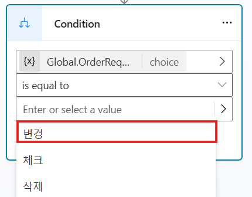

# 조건에서 변수 사용

주제는 현재 엔터티 및 슬롯 채우기 기능으로 두 번째 실습에서
업데이트되었으며, 동적 데이터를 사용하여 변수를 저장하고 메시지에서 해당
변수를 재사용하여 동적 작성 환경을 제공합니다. 이제 Microsoft Copilot
Studio의 조건문에서 동일한 변수를 사용합니다.

Microsoft Copilot Studio의 조건문을 사용하여 작성자는 true,
false 또는 다른 조건(예: 비어 있는 경우)일 수 있는 특정 조건에서 동작을
확인할 수 있습니다. 조건문은 작성 캔버스에서 유연성을 허용하고 촉진하여
여러 유사한 주제를 만들 필요성을 제한하는 동시에 고객의 요구에 따라
뛰어난 고객 또는 사용자 경험을 제공할 수 있습니다. 조건을 사용하기
시작한 후에는 Copilot을 사용하는 사용자가 이동할 수 있는 별도의 흐름을
만드는 분기를 만듭니다. 이러한 분기에는 만들려는 동작에 따라 고유한
조건이 있을 수 있습니다.

조건에 대한 자세한 내용은 조건을 사용하여 작성을 참조하십시오.

## 작업 1: 변수를 사용하여 조건 만들기

이 작업에서는 첫 번째 연습에서 사용자 지정 엔터티에 사용된 세 가지 변수
옵션을 기반으로 조건을 만듭니다.

1.  작성 캔버스의 이전 작업에서 수정한 메시지 노드에서 더하기(**+**)
    아이콘을 선택하여 새 노드를 추가한 다음 **Add a condition**을 선택합니다.

    

2.  두 개의 새 노드가 나타나는데, 하나는 **Condition**이고 다른 하나는 **All other conditions**입니다.
    
    **Condition** 노드에서 **Select a variable** 옵션을 선택한 다음 **OrderRequest** 전역 변수를 선택합니다.
    
    

3.  조건 연산자를 **is equal to**로 유지 한 다음 아래의 빈 상자를 선택하여 선택한 변수에서 사용 가능한 세 가지 옵션을 표시합니다. 

    **변경** 옵션을 선택하십시오.

    \- 펼침 단추 아이콘(\>)이 아닌 **Enter or select a value** 부분을 클릭했는지 확인하세요.
    
    

4.  \"**OrderRequest**가 **변경**과 같은 경우\" 인 조건이 만들어졌습니다.

5.  **OrderRequest** 변수에 대한 두 가지 다른 옵션(확인 및 취소)에 대해 이 분기에 두 개의 조건을 더 만듭니다. 
    **Condition**위의 더하기 **(+)** 아이콘을 클릭하고, **Add a condition**을 선택하여 다른 조건부 분기를 추가합니다.
    
    

6.  **Global.OrderRequest** 변수를 선택하여 이전 단계를 반복 한 다음 두 개의 다른 조건에서 **체크** 및 **취소** 옵션을 선택하여 다음
    스크린샷과 같이 세 가지 옵션(다른 모든 조건 포함)이 있는 조건부 분기를 만듭니다.
    
    

7.  각 condition 노드 아래에 다음 예제와 같이 조건에 따라 다른 텍스트를 표시하는 Message 노드를 추가합니다.

    ```
    잠시만요. 귀하의 주문을 업데이트해 드리겠습니다.
    ```
  
    

     **전문가 팁:** 노드를 선택하고 왼쪽 상단 생산성 도구 메뉴로 복사하여 작업을 더 빠르게 처리하세요. 복사한 후에는 동일한 생산성 도구 메뉴를 사용하거나 (+) 아이콘을 사용하여 새 노드를 추가할 때 노드를 붙여넣을 수 있습니다.

    

8.  Topic을 **저장**한 다음 **Test** 옵션을 선택하여 사용자가 다양한 메시지 결과를 보도록 유도하는 다양한 트리거 문구와 조건을 탐색합니다.

    조건은 사용자가 이전 질문에서 선택하거나 답변한 내용을 기반으로 맞춤형 환경을 만드는 데 도움이 되는 기본 도구입니다. 
    더 복잡한 논리를 위해 다른 조건 내에 조건을 중첩할 수 있습니다.
    
축하합니다, 이제 조건을 사용하고 변수를 조건 내의 매개변수로 사용하는 기본 사항을 완료했습니다.
