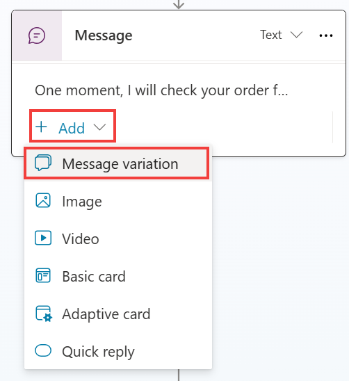

# Message variation (메시지 변형)

메시지 노드를 사용하여 사용자에게 메시지를 표시할 수 있습니다. 
메시지 노드의 기본 사항은 이전 랩과 이 랩의 이전 작업에서 다루었습니다. 
메시지 및 질문 노드도 메시지 변형을 지원합니다.
메시지 변형을 사용하면 단일 노드에 최대 15개의 메시지를 추가할 수 있으므로 조종사가 트리거될 때 무작위로 메시지 변형을 선택합니다. 
메시지 변형을 사용하면 조종사 작성자가 동일한 메시지 노드에 다양한 스타일의 문장을 추가할 수 있으며, 런타임에 Microsoft Copilot Studio는 토픽이 트리거될 때 무작위로 하나의 메시지 변형을 선택합니다. 
이 기능을 통해 작성자는 자연스러운 상호 작용을 만들 수 있으며, 시간이 지남에 따라 조종사와 상호 작용할 때 고객에게 보다 자연스러운 사운드 경험을 제공합니다.

**팁:** Topic이 트리거될 때 메시지 변형이 무작위로 선택되기 때문에 특정 스타일에 의존하는 경험을 제공하면서 경우에 따라 차별화를 제공하는 더 작은 확률을 제공하려는 경우 동일한 메시지의 여러 버전을 추가할 수 있습니다.

다음 연습 에서는 기존 **메시지** 노드에 **메시지 변형** 노드를 추가합니다.

1.  이 랩에서 작업했던 **주문 상태 확인** 토픽을 엽니다. 
    이전 이미지에 표시된 주문 상태 확인 분기와 같이 **메시지 변형**을 추가하려는 **메시지** 노드를 선택합니다.

2.  메시지 노드 내에서 **Add \> Message variation**를 선택합니다.

    


3.  선택한 메시지 변형을 하나 이상 추가하거나 다음 예를 사용하여 메시지 변형이 메시지 노드에서 어떻게 쌓이는지 관찰할 수 있습니다. 
    예를 들어, **변경** 조건 경로에서:

    ```
    고객님의 주문을 확인중입니다. 잠시만 기다려주세요.
    ```
  
축하합니다, 이제 메시지 노드 사용의 기본 사항을 완료 했습니다 . 이제 테스트 옵션을 선택하여 메시지 변형 테스트를 연습 한 다음 조건을 여러 번 트리거하여 작동하는 것을 관찰할 수 있습니다.

**메시지** 노드에는 이러한 랩에서 다루지 않는 고급 기능인 다른 속성이 있습니다.
