## 작업 2: Power Automate 클라우드 흐름 만들기 

1.  아래 스크린샷과 같이 **Question** 노드 아래의 **(+)** 새 노드 버튼을
    **클릭하고** Call an action(액션 호출)을 **선택한 다음 Basic
    actions(기본 액션**) 아래에서 **Create a flow(플로우 생성**)를
    클릭합니다.

    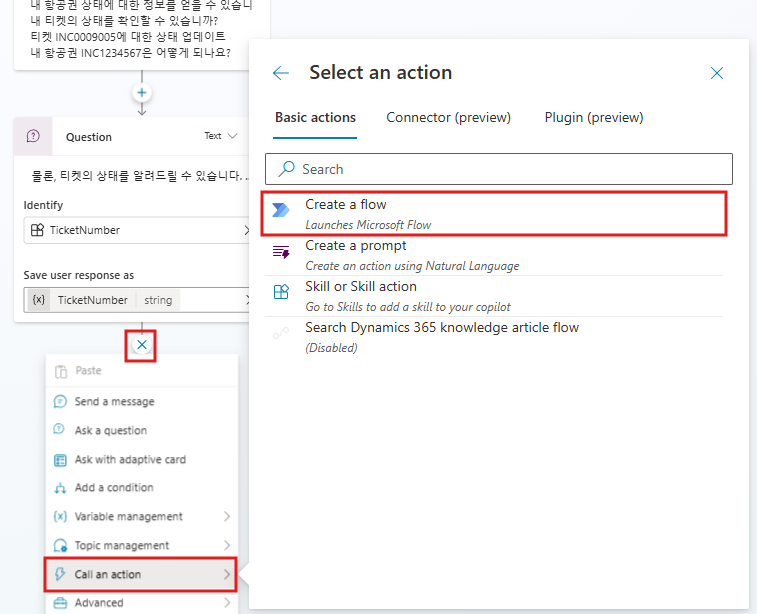

2.  그러면 새 브라우저 창에서 **Power Automate**가 열리고 아래
    스크린샷과 같이 Copilot Studio와 상호 작용하기 위한 새 Power
    Automate 클라우드 흐름에 대한 스캐폴딩 사전 및 사후 작업이
    포함됩니다.

    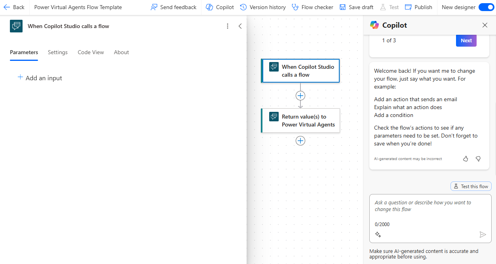

 **전문가 팁:** 오른쪽 상단 모서리에 있는 Power Automate에서 **New Designer**이 활성화 되었는지 확인하세요.


3.  When Copilot Studio calls a flow trigger(Copilot Studio가 흐름 트리거를 호출할 때**)를 클릭하고 왼쪽 창에서 **Add an input(입력
    추가)** 을 클릭합니다.
    
    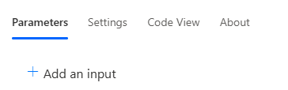

4.  Text 형식의 입력을 추가하고 TicketNumber라고 합니다.

    ```
    TicketNumber
    ```
    
    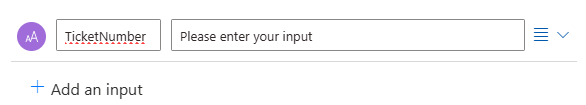

5.  트리거와 방금 추가한 작업 사이에 있는 작업 추가 를 클릭합니다.

    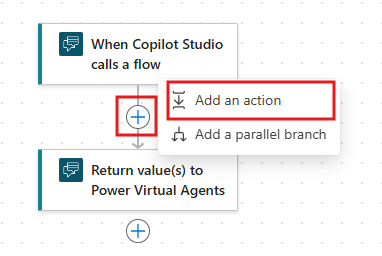

     **참고**: 다음 단계에서 ServiceNow 환경이 활성화되지 않고 연결을 제대로 설정할 수 없는 경우(일반적으로 레코드 유형이 8단계에서 인시던트를 옵션으로 포함하는 목록을 반환하지 않는 경우) 11단계로 건너뜁니다.

6.  검색 창에서 ServiceNow List Records를 검색 하고 List Records를 선택합니다.

    ```
    ServiceNow List Records
    ```

    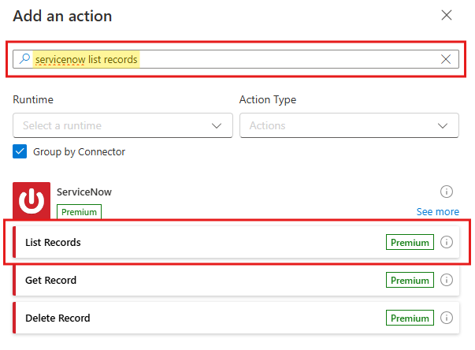

7.  ServiceNow에 대한 연결을 만듭니다.연결의 이름을 고유한 항목(예: ServiceNow - {Your User Name})  으로 지정합니다.인스턴스를 **https://dev258940.service-now.com/**로  설정 하고, 

    ```
    ServiceNow - User50
    ```
    
    ```
    https://dev258940.service-now.com/
    ```

    사용자 이름을 **admin**로 설정 하고,  암호를 다음으로 설정합니다.

    ```
    admin
    ```
    ```
    =qKH8o@Rn5yW
    ```

     그런 다음 **Create New**를 선택합니다.

    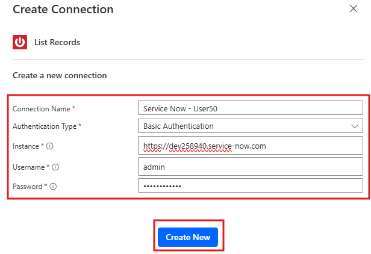

9.  이제 **Record Type(레코드 유형**)에서 Incident(인시던트)를
    선택합니다 (목록에서 Incident(인시던트를 더 쉽게 찾을 수 있도록
    검색할 수 있음)).
    Advanced parameters(고급 매개변수**)에서** Show all(모두 표시**)을
    선택합니다**.
    시스템 참조 표시(Display System References**)를** 예(Yes)로 설정하여
    실제 값을 표시합니다.

     Exclude Reference 링크를 **yes**로 둡니다.\
     쿼리**에** numberCONTAINS를 입력하고 동적 콘텐츠(⚡아이콘)에서
     TicketNumber 입력을 .
     **numberCONTAINS**와 **참조하는** 변수 **사이에** 공백이 없는지
     확인합니다.또는 Query **필드에** 아래를 붙여넣을 수도 있습니다.

    ```
    numberCONTAINS@{triggerBody()?['text']}
    ```

    제한을 1로 설정합니다.

    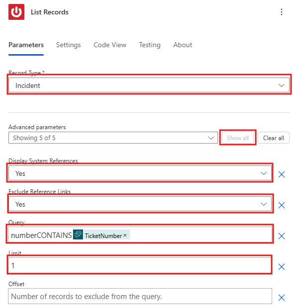

10.  클라우드 흐름에서 **Return value(s) to Power Virtual Agents**를 클릭하고
    **Add an output**을 클릭하여 **Text**를 선택,  **Enter a name**에 **SNTicketInfo**을 입력합니다.

    ```
    SNTicketInfo
    ```

11. **Enter a value to response with**의 경우 수식 버튼 **fx** 를 사용하여 List Records
    본문에서 결과 배열의 첫 번째로 반환된 레코드의 문자열 버전을 가져옵니다.
    아래 수식을 붙여넣고 추가를 선택합니다.

    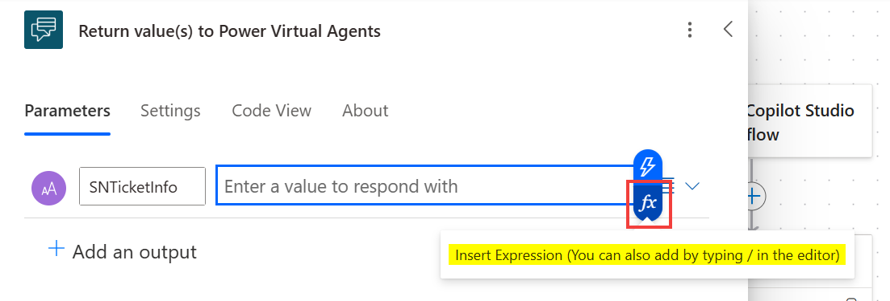

    ```
    string(first(outputs('List_Records')?['body/result']))
    ```
    
    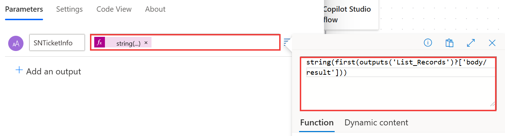

12. **선택적 단계** (ServiceNow가 작동하지 않는 경우): **Enter a value to response with**에 아래 하드코딩된 페이로드를 붙여넣습니다. 
    이는 ServiceNow가 일반적으로 반환하는 내용의 예를 나타냅니다.

    ```
    {
        "parent": "",
        "made_sla": "true",
        "caused_by": "",
        "watch_list": "",
        "upon_reject": "Cancel all future Tasks",
        "sys_updated_on": "2018-12-12 23:18:55",
        "child_incidents": "0",
        "hold_reason": "",
        "origin_table": "",
        "task_effective_number": "INC0009005",
        "approval_history": "",
        "number": "INC0009005",
        "resolved_by": "",
        "sys_updated_by": "admin",
        "opened_by": "System Administrator",
        "user_input": "",
        "sys_created_on": "2018-08-31 21:35:45",
        "sys_domain": "global",
        "state": "New",
        "route_reason": "",
        "sys_created_by": "admin",
        "knowledge": "false",
        "order": "",
        "calendar_stc": "",
        "closed_at": "",
        "cmdb_ci": "",
        "delivery_plan": "",
        "contract": "",
        "impact": "1 - High",
        "active": "true",
        "work_notes_list": "",
        "business_service": "",
        "business_impact": "",
        "priority": "1 - Critical",
        "sys_domain_path": "/",
        "rfc": "",
        "time_worked": "",
        "expected_start": "",
        "opened_at": "2018-08-31 21:35:21",
        "business_duration": "",
        "group_list": "",
        "work_end": "",
        "caller_id": "David Miller",
        "reopened_time": "",
        "resolved_at": "",
        "approval_set": "",
        "subcategory": "Email",
        "work_notes": "2018-12-12 23:18:42 - System Administrator (Work notes)\nupdated the priority to high based on the criticality of the Incident.\n\n",
        "universal_request": "",
        "short_description": "Email server is down.",
        "correlation_display": "",
        "delivery_task": "",
        "work_start": "",
        "assignment_group": "",
        "additional_assignee_list": "",
        "business_stc": "",
        "cause": "",
        "description": "Unable to send or receive emails.",
        "origin_id": "",
        "calendar_duration": "",
        "close_notes": "",
        "notify": "Do Not Notify",
        "service_offering": "",
        "sys_class_name": "Incident",
        "closed_by": "",
        "follow_up": "",
        "parent_incident": "",
        "sys_id": "ed92e8d173d023002728660c4cf6a7bc",
        "reopened_by": "",
        "incident_state": "New",
        "urgency": "1 - High",
        "problem_id": "",
        "company": "",
        "reassignment_count": "0",
        "activity_due": "2018-12-13 01:18:55",
        "assigned_to": "",
        "severity": "3 - Low",
        "comments": "",
        "approval": "Not Yet Requested",
        "sla_due": "UNKNOWN",
        "comments_and_work_notes": "2018-12-12 23:18:42 - System Administrator (Work notes)\nupdated the priority to high based on the criticality of the Incident.\n\n",
        "due_date": "",
        "sys_mod_count": "3",
        "reopen_count": "0",
        "sys_tags": "",
        "escalation": "Normal",
        "upon_approval": "Proceed to Next Task",
        "correlation_id": "",
        "location": "",
        "category": "Software"
    }
    
    ```

13. **Power Automate** flow가 거의 완료되었습니다. 모범 사례로 이동하기 전에 이름을 바꿔야 Copilot Studio와 관리자가 쉽게 찾을 수 있습니다.
    아래 스크린샷과 같이 **Power Virtual Agents Flow Template** 을 클릭하고 이름을 **Get Ticket Status {YourUserName}** 으로 바꿉니다.
    ```
    Get Ticket Status User50
    ```

14. **Publish**를 클릭하고 아래 스크린샷과 같이 녹색 배너가 표시될 때까지 잠시 기다립니다.

     **전문가 팁:** **Publish** 버튼이 보이지 않으면 **Save** 또는 **Save draft**를 클릭하세요.

    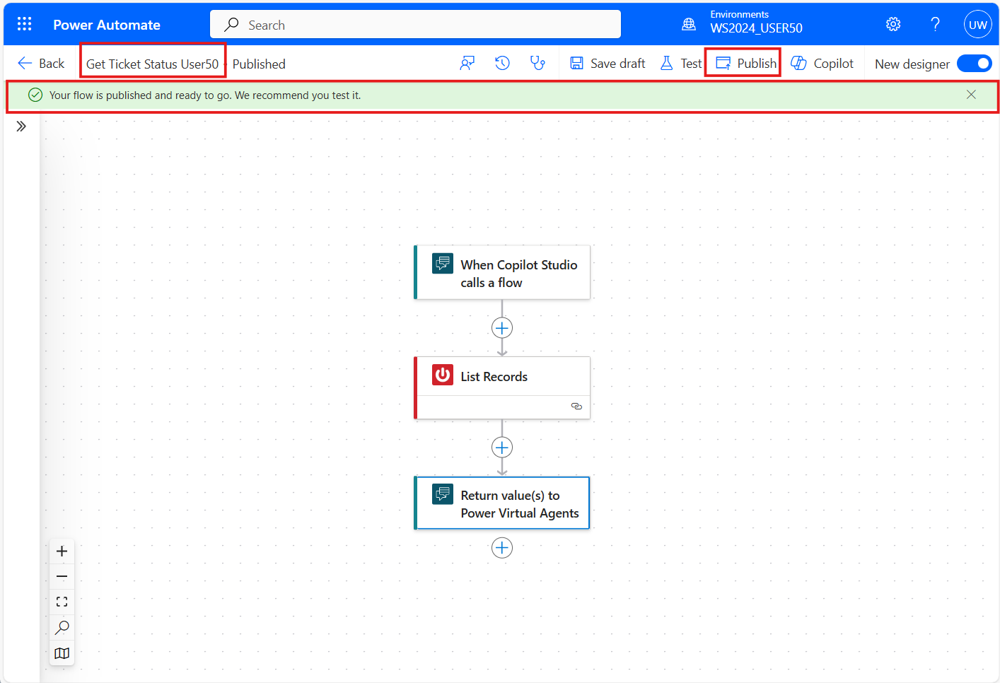

    
    Power Automate에서 작업을 완료했습니다. 이제 Copilot Studio로 다시 전환해 보겠습니다.
