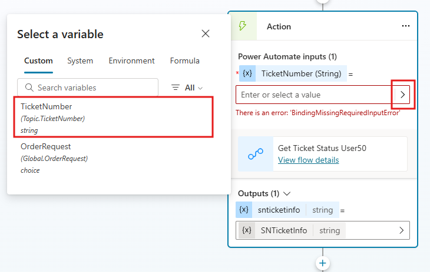

## 작업 3: Copilot Studio에서 Power Automate 클라우드 흐름 호출

1.  Copilot Studio에서 기존 Topic을 열고 아래와 같이 흐름의 맨 아래로 돌아갑니다. 

    **Call an action**을 클릭하면 **Basic actions** 아래의 목록에 새로운 Power Automate 클라우드 흐름이 표시됩니다. 

    목록에서 **Get Ticket Status USer50** 흐름을 선택합니다.

    

    **전문가 팁:** 생성한 클라우드 흐름이 보이지 않으면 주제를 저장하고 페이지를 새로 고쳐 다시 시도하세요.

2.  **Get Ticket Status USer50** 를 선택하면 새 Action 노드가 자동으로 추가되는 것을 볼 수 있습니다.

    흐름에 입력이 필요한 경우 값을 선택하도록 요청합니다.

    이전 단계에서 만든 흐름에는 **TicketNumber** 입력이 필요하므로 사용자로부터 값이 저장된 변수(랩 이전 단계의 **TicketNumber**)를
    선택하여 이 입력을 Power Automate 작업에 추가해야 합니다.

3.  **Enter or select a value** 를 선택하고 이 랩의 이전 단계에서 만든 **TicketNumber**변수를 선택합니다. 

    이제 Power Automate 흐름에 연결되고 Power Automate의 결과를 **SNTicketInfo** 변수에 출력합니다.

    

    **전문가 팁**

    • 통합에서 대기 시간이 예상되는 경우 작업 속성으로 이동하여 대기 시간 메시지를 추가합니다
      (예: 이 세부 정보를 가져오고 있습니다. 잠시만요...)

    • Power Automate에서 클라우드 흐름을 호출하고 실행하는 추가 대기 시간을 피하기 위해 Microsoft Copilot Studio에서 직접 HTTP 요청 및 커넥터를 사용하는 것을 고려하세요.

4.  **ServiceNow**는 인시던트의 전체 세부 정보를 기술적인 JSON 형식으로 반환하므로 Copilot Studio가 스키마를 기반으로 콘텐츠를 완전히 이해할 수 있도록 구문 분석해야 합니다.

    이렇게 하려면 **Variable management**를 선택한 다음, **Parse  value**를 선택합니다.

    

     JSON을 구문 분석하려면 ServiceNow의 Rest API 탐색기를 사용하여 본문의 구조를 가져오거나 샘플 페이로드에서 스키마를 가져올 수 있습니다.
     실습을 위해 아래에 샘플 ServiceNow 데이터를 제공하고 있습니다.
    
    아래 텍스트를 복사하는 데 어려움이 있으면 Lab 파일의 Misc 폴더로 이동하여 ServiceNow Sample JSON Payload.txt를 엽니다.

    ```
    {
        "parent": "",
        "made_sla": "true",
        "caused_by": "",
        "watch_list": "",
        "upon_reject": "Cancel all future Tasks",
        "sys_updated_on": "2018-12-12 23:18:55",
        "child_incidents": "0",
        "hold_reason": "",
        "origin_table": "",
        "task_effective_number": "INC0008111",
        "approval_history": "",
        "number": "INC0009005",
        "resolved_by": "",
        "sys_updated_by": "admin",
        "opened_by": "System Administrator",
        "user_input": "",
        "sys_created_on": "2018-08-31 21:35:45",
        "sys_domain": "global",
        "state": "New",
        "route_reason": "",
        "sys_created_by": "admin",
        "knowledge": "false",
        "order": "",
        "calendar_stc": "",
        "closed_at": "",
        "cmdb_ci": "",
        "delivery_plan": "",
        "contract": "",
        "impact": "1 - High",
        "active": "true",
        "work_notes_list": "",
        "business_service": "",
        "business_impact": "",
        "priority": "1 - Critical",
        "sys_domain_path": "/",
        "rfc": "",
        "time_worked": "",
        "expected_start": "",
        "opened_at": "2018-08-31 21:35:21",
        "business_duration": "",
        "group_list": "",
        "work_end": "",
        "caller_id": "David Miller",
        "reopened_time": "",
        "resolved_at": "",
        "approval_set": "",
        "subcategory": "Email",
        "work_notes": "2018-12-12 23:18:42 - System Administrator (Work notes)\nupdated the priority to high based on the criticality of the Incident.\n\n",
        "universal_request": "",
        "short_description": "Email server is down.",
        "correlation_display": "",
        "delivery_task": "",
        "work_start": "",
        "assignment_group": "",
        "additional_assignee_list": "",
        "business_stc": "",
        "cause": "",
        "description": "Unable to send or receive emails.",
        "origin_id": "",
        "calendar_duration": "",
        "close_notes": "",
        "notify": "Do Not Notify",
        "service_offering": "",
        "sys_class_name": "Incident",
        "closed_by": "",
        "follow_up": "",
        "parent_incident": "",
        "sys_id": "ed92e8d173d023002728660c4cf6a7bc",
        "reopened_by": "",
        "incident_state": "New",
        "urgency": "1 - High",
        "problem_id": "",
        "company": "",
        "reassignment_count": "0",
        "activity_due": "2018-12-13 01:18:55",
        "assigned_to": "",
        "severity": "3 - Low",
        "comments": "",
        "approval": "Not Yet Requested",
        "sla_due": "UNKNOWN",
        "comments_and_work_notes": "2018-12-12 23:18:42 - System Administrator (Work notes)\nupdated the priority to high based on the criticality of the Incident.\n\n",
        "due_date": "",
        "sys_mod_count": "3",
        "reopen_count": "0",
        "sys_tags": "",
        "escalation": "Normal",
        "upon_approval": "Proceed to Next Task",
        "correlation_id": "",
        "location": "",
        "category": "Software"
    }
    ```

5.  이제 Power Automate 흐름 작업에서 **SNTicketInfo** 변수를 선택하여 구문 분석할 값을 선택해야 합니다.

6.  다음으로 **Data Type**을 **From sample data**를 선택합니다.
    
    

7.  이제 **Get schema from sample JSON**을 선택하고, 위 단계에서 제공된 JSON 샘플에 붙여넣고 **Confirm**을 클릭합니다.

    

8.  그런 다음 나중에 사용자를 위해 구문 분석된 레코드를 저장할 변수를 설정합니다.

    **SNTicketInfoParsed**라는 변수를 만듭니다. 

    해당 유형은 스키마(레코드)에 따라 자동으로 설정됩니다.

    ```
    SNTicketInfoParsed
    ```
 
9.  이제 응답을 추가하여 부조종사 사용자에게 티켓의 상태를 알려주는 형식화된 응답을 제공합니다.
    
    **(+)** 를 클릭하여 새 노드를 추가하고 **Send a message**를 선택합니다.

    **Bold** 명령바를 이용하거나 **\*\*** 로 감싸서 중요 정보를 굵게 표시해줍니다.

    ```
    티켓 번호 {Topic.TicketNumber} ({Topic.SNTicketInfoParsed.short_description}) 의 상태는  {Topic.SNTicketInfoParsed.state} 입니다.
    ```
    
    **전문가 팁:** Copilot Studio와 일부 채널은 간단한 서식을 위한 Markdown을 지원합니다.
    
    
    
    위의 샘플 JSON을 보고 어떤 데이터가 어떤 값으로 반환되는지 확인할 수 있지만, 아래는 메시지를 구조화하는 데 도움이 되도록 나중에 조회할 티켓의 스크린샷입니다.
    
    

10. 대화를 종료하려면 **Topic management**를 선택하고 **Go to another topic**을 선택하여 **대화 종료**를 선택합니다.

11. Topic을 **저장**하고 코파일럿을 테스트하십시오.
    
    ```
    내 항공권의 티켓번호 INC0008111의 상태는 어떤가요?
    ```

12. 항공권 번호 **INC0008111**의 상태를 확인하십시오

    
    
    Power Automate 클라우드 흐름과 Microsoft Copilot Studio에서 이 흐름을 사용하여 외부 서비스의 실시간 데이터를 사용자에게 제공하는 새 토픽을 성공적으로 만들었습니다!
