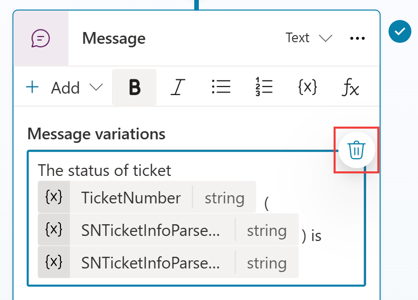
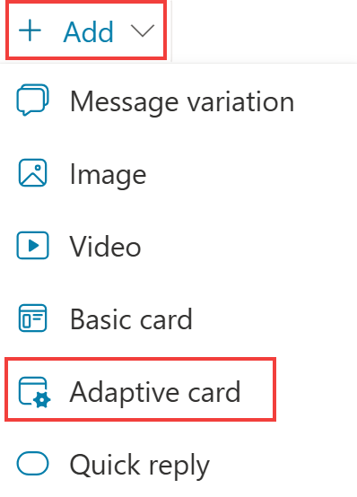
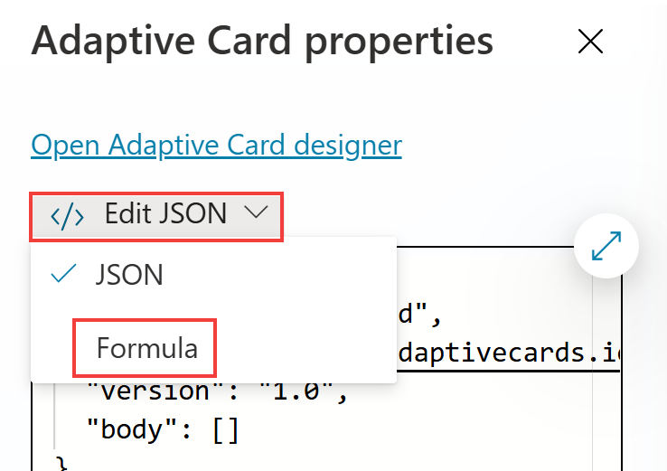
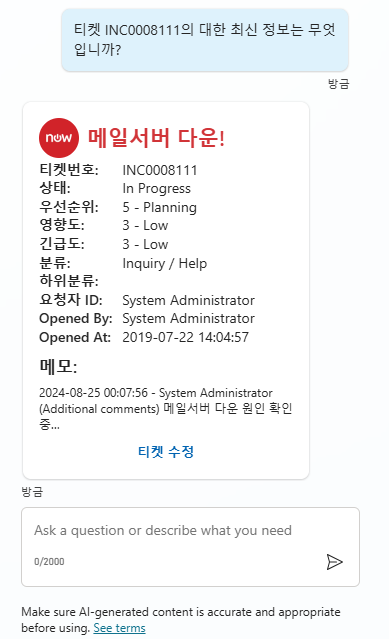

## 작업 4: 적응형 카드에 ServiceNow 티켓 정보 표시

1.  **티켓 상태 확인** Topic으로 이동합니다.

2.  **Message variation**을 삭제합니다.

    

3.  **Add** > **Adaptive card**를 선택합니다.

    

4.  **Edit JSON**에서 **Formula**로 전환하여 적응형 카드를 동적으로 만들고 PowerFx 언어로 작성할 수 있습니다.

    

5.  **ServiceNow** 티켓 정보에 대한 참조가 이미 포함되어 있는 아래의 PowerFx 수식을 붙여넣습니다

    아래 텍스트를 복사하는 데 어려움이 있으면 Lab 파일의 Misc 폴더로 이동하여 ServiceNow Adaptive Card Power Fx.txt를 엽니다.

    ```
    {
      type: "AdaptiveCard",
      version: "1.5",
      body: [
        {
          type: "ColumnSet",
          columns: [
            {
              type: "Column",
              width: "auto",
              items: [
                {
                  type: "Image",
                  url: "https://www.servicenow.com/community/s/legacyfs/online/avatars_servicenow/1f66cb9fdb3ee3c0107d5583ca961942.jpg",
                  size: "Small",
                  style: "Person"
                }
              ]
            },
            {
              type: "Column",
              width: "stretch",
              items: [
                {
                  type: "TextBlock",
                  text: Topic.SNTicketInfoParsed.short_description,
                  weight: "Bolder",
                  size: "Large",
                  wrap: true,
                  color: "Attention",
                  horizontalAlignment: "Left"
                }
              ],
              verticalContentAlignment: "Center",
              horizontalAlignment: "Center"
            }
          ]
        },
        {
          type: "TextBlock",
          text: Topic.SNTicketInfoParsed.description,
          weight: "Lighter",
          wrap: true
        },
        {
          type: "FactSet",
          facts: [
            {
              title: "티켓번호:",
              value: Topic.SNTicketInfoParsed.number
            },
            {
              title: "상태:",
              value: Topic.SNTicketInfoParsed.state
            },
            {
              title: "우선순위:",
              value: Topic.SNTicketInfoParsed.priority
            },
            {
              title: "영향도:",
              value: Topic.SNTicketInfoParsed.impact
            },
            {
              title: "긴급도:",
              value: Topic.SNTicketInfoParsed.urgency
            },
            {
              title: "분류:",
              value: Topic.SNTicketInfoParsed.category
            },
            {
              title: "하위분류:",
              value: Topic.SNTicketInfoParsed.subcategory
            },
            {
              title: "요청자 ID:",
              value: Topic.SNTicketInfoParsed.caller_id
            },
            {
              title: "Opened By:",
              value: Topic.SNTicketInfoParsed.opened_by
            },
            {
              title: "Opened At:",
              value: Topic.SNTicketInfoParsed.opened_at
            }
          ],
          spacing: "Small"
        },
        {
          type: "TextBlock",
          text: "메모:",
          weight: "Bolder",
          size: "Medium",
          wrap: true
        },
        {
          type: "TextBlock",
          text: Topic.SNTicketInfoParsed.comments_and_work_notes,
          wrap: true,
          size: "Small"
        }
      ],
      actions: [
        {
          type: "Action.OpenUrl",
          title: "티켓 수정",
          url: "https://dev258940.service-now.com/nav_to.do?uri=incident.do?sys_id=" & Topic.SNTicketInfoParsed.sys_id & "%26sysparm_view=ess"
        }
      ],
      '$schema': "http://adaptivecards.io/schemas/adaptive-card.json"
    }
    
    ```

6.  **Save**를 클릭합니다.


7.  코파일럿을 테스트하십시오.

    ```
    티켓 INC0008111의  대한 최신 정보는 무엇입니까?    
    ```
      
    

# 요약

 랩 03 \'부조종사에서 Power Automate 클라우드 흐름 빌드 및 호출\'을 완료해 주셔서 감사합니다. 다음을 성공적으로 수행했습니다.

-   새 Power Automate 클라우드 흐름을 만들었습니다.
-   Power Automate 클라우드 흐름을 토픽에 호출했습니다.
-   입력 및 출력 변수 설정
-   Copilot Studio에서 사용자에게 동적 데이터를 표시했습니다.
