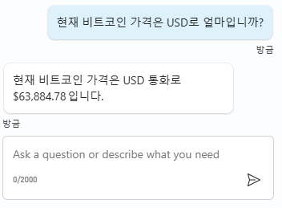

# 연습 1: 간단한 HTTP 요청 노드 쿼리 작성

 데이터에 연결하는 것은 고객이나 사용자 질문에 대한 최신 정보와 통찰력을 제공하므로 회사에 큰 이점을 제공합니다.

 이 연습에서는 새 주제를 생성하고 외부 서비스에서 정보를 검색하기 위해 간단한 HTTP 요청 노드 작업을 추가한 다음 해당 데이터를 사용자에게
 표시하는 과정을 거칩니다.

## Task 1: 새 토픽 생성

1.  Copilot Studio 작성 캔버스의 주제 페이지를 열고 화면 상단의 주제 추가 드롭다운에서 빈 페이지에서 시작 옵션을 선택합니다. 주제 이름을 \'암호화폐 가격\'으로 지정합니다.

    ```
    암호화폐 가격
    ```

2.  사용자가 묻는 트리거 문구를 몇 가지 추가합니다. 예를 들면 다음과 같습니다:

    ```
    현재 비트코인 ​​가격은 얼마입니까?
    최신 암호화폐 가격을 알려주시겠습니까?
    현재 비트코인 ​​가격은 얼마입니까?
    오늘날 디지털 통화 가격은 얼마입니까? 
    암호화폐 가격에 대한 최신 소식은 무엇입니까?
    ```

3.  새 질문 노드를 생성하고 다음 텍스트를 입력합니다.
   
    ```
    비트코인의 현재 가격을 어느 통화로 보고 싶으신가요?
    ```

5.  이 질문을 선택지로 설정하고 USD, EUR, GBP 옵션을 추가합니다. 응답을 변수 \'Currency\'로 저장합니다.
   
    각 옵션에 대한 동의어를 추가합니다. 예: 달러, 유로, 파운드.

    

     **Pro tip:** 원하는 옵션을 선택하고 동의어를 추가하면 됩니다. 예를 들어 달러를 USD로 변환하는 식으로요.

5.  Copilot Studio는 질문 노드 아래에 자동으로 선택 조건 논리를 생성합니다.

    이 시나리오에서는 모든 조건을 제거해야 합니다. 이를 위해 세 개의 점(···)
    아이콘을 클릭한 후 삭제(Delete)를 선택합니다.

    

6.  HTTP 요청 노드를 추가하여 API 호출을 통해 비트코인의 가격을 확인합니다. 

    (+) 버튼을 클릭하고 고급 옵션에서 HTTP 요청 보내기를 선택합니다.

    

7. Copilot Studio가 선택한 통화로 비트코인의 가격을 가져올 수 있도록 API
    정보를 제공해야 합니다. URL 필드에서 공식을 선택하고 다음 PowerFx
    공식을 입력합니다:

    ```
    Lower(Concatenate("https://api.gemini.com/v2/ticker/btc",Topic.Currency))
    ```

         

    이 공식은 여러 가지 작업을 수행합니다. 먼저 전달된 URL을 소문자로
    변환한 후, 위의 질문에서 사용자가 선택한 통화를 포함하도록 URL을
    연결합니다. 이를 통해 USD나 KRW와 같은 통화에 대한 URL이 API에
    올바르게 전달되도록 합니다.:

8.  이제 노드가 응답을 파싱할 수 있도록 API에서 반환될 JSON 페이로드의
    샘플 출력을 제공해야 합니다. 이를 위해 HTTP 요청 노드의 응답 데이터
    유형 필드에서 샘플 데이터에서 가져오기를 선택합니다. 그런 다음, 샘플
    JSON에서 스키마 가져오기를 선택하고 아래 샘플 JSON 페이로드를
    붙여넣습니다

     **Pro tip:** 아래 텍스트를 복사하는 데 어려움이 있으면 Lab 파일의 Misc 폴더로 이동하여 Bitcoin Sample JSON Payload.txt를 엽니다.

    ```
    {
      "symbol": "BTCUSD",
      "open": "67781.09",
      "high": "68382.33",
      "low": "67293.74",
      "close": "67707.13",
      "changes": [
        "67882.6",
        "67781.09",
        "67805.66",
        "67744.15",
        "67651.01",
        "67863.46",         
        "68053.16",
        "68080.11",
        "68186.09",
        "68109.26",
        "67914.8",
        "68079.54",
        "67455.47",
        "67468.58",
        "67712.98",
        "67662.82",
        "67771.15",
        "67680.26",
        "67799.25",
        "67736.21",
        "67653.87",
        "67698.36",
        "67832.24",
        "67707.13"
      ],
      "bid": "67837.17",
      "ask": "67843.41"
    }
    ```

9. 확인을 선택합니다.

10. API에서 파싱된 결과를 저장할 변수를 생성합니다. 변수 이름을 \'CryptoCurrentPrice\'로 지정합니다.

    ```
    CryptoCurrentPrice
    ```

      

11. 이제 봇 사용자에게 비트코인의 현재 가격을 알려주는 포맷된 응답
    메시지를 추가해 보겠습니다. (+) 버튼을 클릭하여 새 노드를 추가하고
    메시지 보내기를 선택합니다. 변수를 활용하여 비트코인의 가격에 대한
    사용자 응답을 구성하는 메시지를 작성할 수 있습니다.

    ```
    현재 비트코인 가격은 {Topic.Currency} 통화로 {Topic.CryptoCurrentPrice.bid} 입니다.
    ```

    가격을 특정 형식으로 포맷하기 위해 공식 사용:

    ```
    Switch(
      Text(Topic.Currency),    
      "USD",
      Text(Value(Topic.CryptoCurrentPrice.bid),"$#,#.##"),
      "EUR",
      Text(Value(Topic.CryptoCurrentPrice.bid),"#,#.##€"),
      "GBP",
      Text(Value(Topic.CryptoCurrentPrice.bid),"£#,#.##")
    )
    ```

      

14. 대화를 종료하려면 주제 관리를 선택하고 다른 주제로 이동을 선택한 후 대화 종료를 선택합니다.

15. **주제**를 저장합니다.

## Task 2: 주제 테스트

1.  Open the **test** pane and test your copilot. 테스트 창을 열고 Copilot을 테스트합니다:

    ```    
    현재 비트코인 가격은 USD로 얼마입니까?
    ```

      


    여러분은 외부 서비스에서 실시간 데이터를 제공하기 위한 HTTP 요청 노드를 성공적으로 생성했습니다!

# Summary 요약

랩04 \'API에 연결하기 위한 HTTP 요청 만들기\'를 완료해 주셔서
감사합니다. 여러분은 다음 작업을 성공적으로 완료했습니다:

-   Copilot Studio에서 HTTP API 호출 생성
-   Power Fx를 사용하여 GET API 호출 구조화
-   Copilot Studio에서 동적 데이터를 사용자에게 표시
