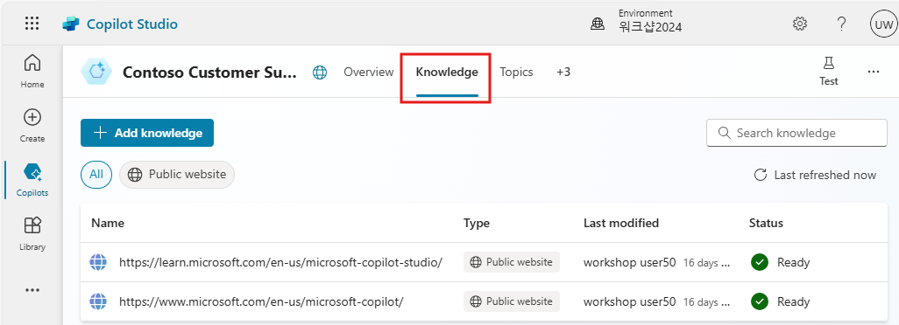
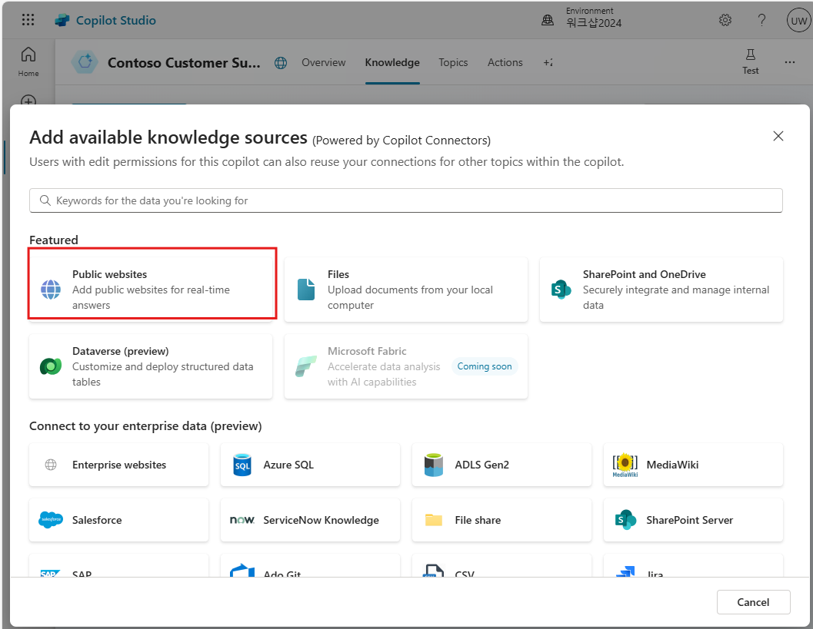
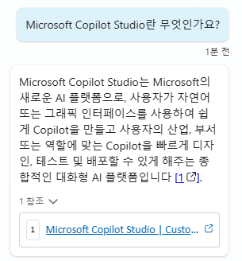
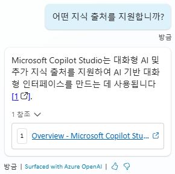

# Knowledge sources (지식 소스)

Microsoft Copilot Studio에서의 지식은 Power Platform, Dynamics 365
데이터 및 외부 시스템의 엔터프라이즈 데이터를 추가하여 코파일럿이 최종
사용자에게 관련 정보와 통찰력을 제공할 수 있게 합니다. 또한 생성적
응답에 지식을 통합할 수 있습니다. 지식을 포함하는 게시된 코파일럿은
구성된 지식 소스를 사용하여 게시된 코파일럿을 보강합니다.

**지원되는 지식 소스**

  |  이름  | 소스 |  설명 |    일반 응답에서 지원되는 입력 수  |  인증  |
  | --- | --- | --- | --- | --- |
  | 공개 웹사이트 | 외부 | Bing에서 쿼리 입력을 검색하며 제공된 웹사이트의 결과만 반환합니다.  |    4개의 공개 URL (예:microsoft.com)    |  없음 |
  | 문서 | 내부 | Dataverse에 업로드된 문서를 검색하여 문서 내용에서 결과를 반환합니다.  |   Dataverse 파일 저장 할당량에 의해 제한   | 없음 |
  | SharePoint | 내부 |  SharePoint URL에 연결하여 GraphSearch를 사용하여 결과를 반환합니다.   | 4개의 URL   |     코파일럿 사용자의 Microsoft Entra ID 인증 |
  | OneDrive for Business | 내부 |  OneDrive URL에 연결하여  GraphSearch를 사용하여 결과를 반환합니다.    | 4개의 URL    | 코파일럿 사용자의 Microsoft Entra ID 인증 |
  | Dataverse  | 내부 |   연결된 Dataverse 환경에 연결하고 Dataverse의 검색 증강 생성 기술을 사용하여 결과를 반환합니다. | 2개의 Dataverse 지식 소스(지식 소스당 최대 15개의 테이블)  |   코파일럿 사용자의 Microsoft Entra ID 인증 |
  | 그래프 연결을 통한 엔터프라이즈 데이터 | 내부 | 연결된 Dataverse 환경에 연결하고 Dataverse의 검색 증강 생성 기술을 사용하여 결과를 반환합니다. | 커스텀 코파일럿당 2개 |  코파일럿 사용자의 Microsoft Entra ID 인증 |

## Websites 웹사이트

### 작업 1: 웹사이트 지식 소스 구성

1.  코파일럿의 **Knowledge** 탭으로 이동합니다.

    

    이전 실습에서 공개 웹사이트와 같은 기존 지식 소스를 볼 수 있습니다.
    
    - <https://learn.microsoft.com/en-us/microsoft-copilot-studio/>    
    - <https://www.microsoft.com/en-us/microsoft-copilot/>

2.  **Add Knowledge**를 선택합니다.

3.  새로운 웹사이트(예: https://adoption.microsoft.com/en-us/ )를 추가합니다. 각 지식 소스에는 반환할 수 있는 내용에 대한 명확한 설명을 제공해야 합니다.

    ```
    https://adoption.microsoft.com/en-us/
    ```

    

    **Pro tip:**

      - 기본 내장 자연어 이해 모델을 사용할 때 지식 소스는 생성 답변 생성 노드에서 호출됩니다. 
        기본적으로 토픽을 트리거하지 않는 사용자 문장은 생성 답변 노드가 미리 구성된 대화형 부스팅(Conversational boosting) 토픽으로 이동합니다.
      - 생성 AI 오케스트레이션이 활성화되면 대규모 언어 모델은 각 지식 소스 모델 설명을 보고 사용자 쿼리에 답변하는 데 사용할 데이터 소스를 파악합니다.

### 작업 2: 웹사이트 지식 소스 테스트

1. **Test** 창을 엽니다.

2. 기존 주제와 일치하지 않는 질문을 하여 **Conversational boosting** Topic을 트리거합니다.

    ```
    Microsoft Copilot Studio란 무엇인가요?
    ```

3.  답변을 생성하고, 답변의 근거가 되는 **인용문**을 포함하며, 사용자에게 이 답변을 생성하는 데 사용된 **출처**로 이동할 수 있는 옵션을 제공한다는 점에 유의하세요.

    

4.  **후속 질문**을 합니다.

    ```
    어떤 지식 출처를 지원합니까?
    ```
    

후속 질문이 특정 제품을 언급하지 않았음에도 불구하고, 생성적 응답 기능은 대화의 이전 메시지 **맥락을 유지**하고 후속 질문을 올바르게 해석합니다.


