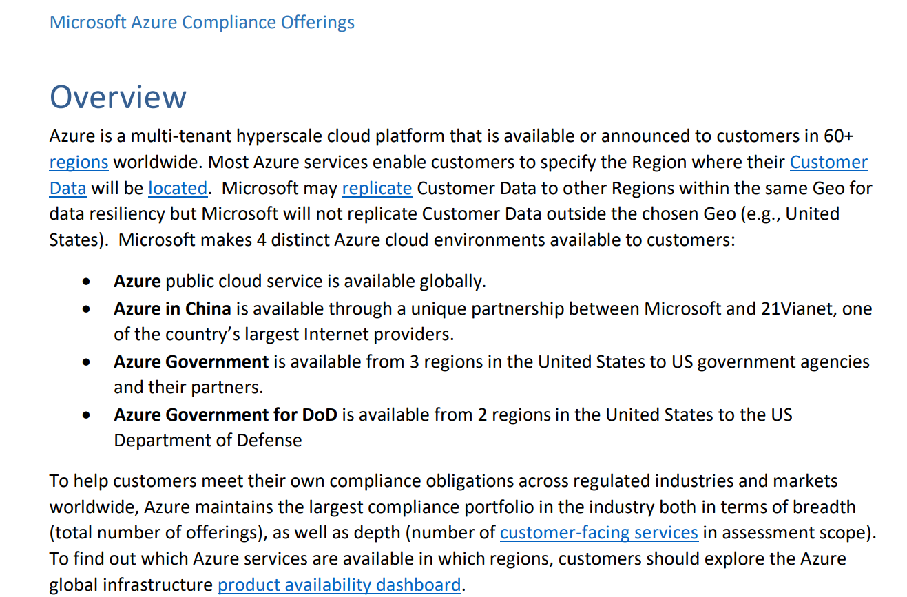

# Files

## Task 1: 파일 지식 소스 구성

1.  다음 URL에서 **Azure - Compliance Offerings** 문서를 다운로드합니다.
    
    <https://servicetrust.microsoft.com/DocumentPage/7adf2d9e-d7b5-4e71-bad8-713e6a183cf3>

2.  코파일럿의 **Knowledge** 탭으로 이동하여 **Add Knowledge**를 선택합니다.

3.  파일을 선택하고 1단계에서 다운로드한 문서를 **업로드**한 후 추가를 클릭합니다.

## Task 2: 파일 지식 소스 테스트

1.  코파일럿의 **Knowledge** 탭으로 이동합니다. 업로드한 파일의 상태가 **Ready**로 표시될 때까지 기다립니다. 상태를 업데이트하려면 새로 고침 아이콘을 클릭합니다.

     **Pro tip:** 파일이 인덱싱되는 동안 다른 랩의 데이터 소스와 작업을 탐색하고 완료하세요.

2.  **Test** 창을 엽니다.

3.  기존 Topic과 일치하지 않는 질문을 하여 **Conversational boosting** Topic을 트리거합니다.
 
    ```
    Microsoft는 고객에게 어떤 4가지의 고유한 Azure 클라우드 환경을 제공합니까?
    ```

4.  **인용문**이 어떻게 다르게 표현되는지 주목하세요

    

    아래 PDF에서 실제로 답변에 사용된 인용문을 확인할 수 있습니다. 

    

