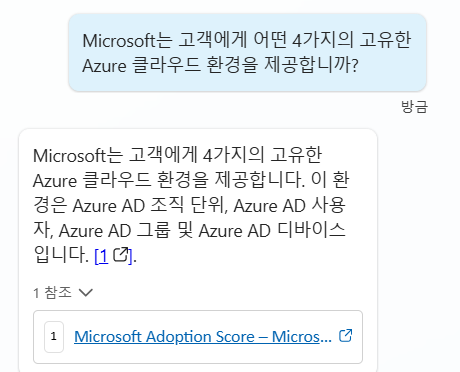

# Files

## Task 1: 파일 지식 소스 구성

1.  <https://servicetrust.microsoft.com/DocumentPage/7adf2d9e-d7b5-4e71-bad8-713e6a183cf3> 에서 Azure - Compliance Offerings 문서를 다운로드합니다.

2.  코파일럿의 지식 탭으로 이동하여 지식 추가를 선택합니다.

3.  파일을 선택하고 1단계에서 다운로드한 문서를 업로드한 후 추가를 클릭합니다.

## Task 2: 파일 지식 소스 테스트

1.  코파일럿의 지식 탭으로 이동합니다. 업로드한 파일의 상태가 준비됨으로 표시될 때까지 기다립니다. 상태를 업데이트하려면 새로 고침 버튼을 클릭합니다.

     **Pro tip:** 파일이 인덱싱되는 동안 다른 랩의 데이터 소스와 작업을 탐색하고 완료하세요.

2.  테스트 창을 엽니다.

3.  기존 주제와 일치하지 않는 질문을 하여 대화 증진 주제를 트리거합니다.
 
    ```
    Microsoft의 Azure 클라우드 환경은 무엇입니까?
    ```

4.  참조가 다르게 렌더링되는 것을 확인하십시오.

    

