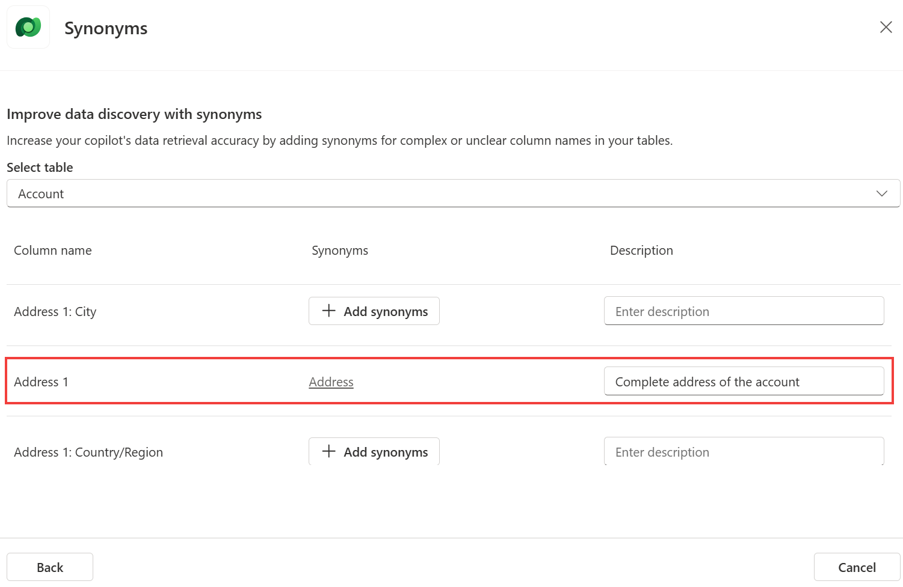
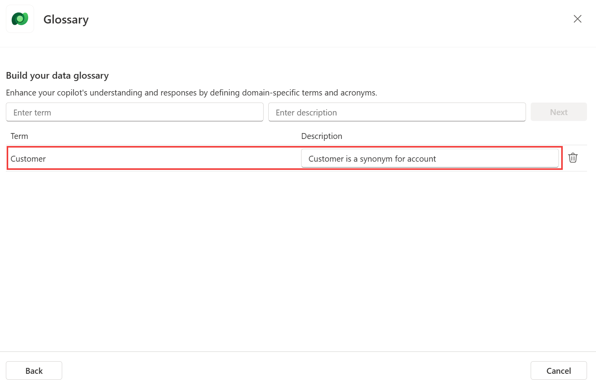
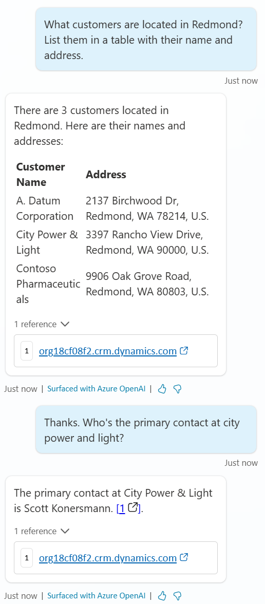

# Dataverse 

## Task 1: Dataverse 지식 소스 구성

Dataverse 지식 소스를 사용하면 Dataverse 테이블에 저장된 구조화된 데이터에 대해 자연어 쿼리를 할 수 있습니다.

1.  코파일럿의 **Knowledge** 탭으로 이동하여 **Add Knowledge**를 선택합니다.

2.  **Dataverse**를 선택하고 **\'Account\'** 테이블을 검색하여 선택한 후 **Next**를 클릭합니다.

3.  테이블에 데이터가 포함되어 있는지 확인하고 **Next**를 클릭합니다.

4.  특정 테이블 속성에 대한 질문을 이해하기 위해 **Synonyms (동의어)**에서 **Edit**을 선택합니다. 

    예를 들어, **\'Address 1\'**에 대해 **동의어**로 **\'Address\'** 를 추가하고 설명에 **\'Complete address of the account\'** 를 입력합니다. 

    ```
    Address
    ```

    ```
    Complete address of the account
    ```

    그런 다음 **Back**를 선택합니다.

    

5.  계정에 대한 사용자 질문 이해를 개선하기 위해 **Glossary (용어집)**에서 **Edit**을 선택합니다. 

    예를 들어, **\'Customer\'**를 용어로 추가하고 설명에 **\'Customer is a synonym for account\'**를 입력합니다. 

    ```
    Customer
    ```

    ```
    Customer is a synonym for account
    ```

    그런 다음 **Next**를 선택한 후 **Back**를 선택합니다.

    

6.  **\'Knowledge name\'** 과 **\'Knowledge description\'** 는 기본값을 유지합니다.

7.  **Add**를  클릭합니다.

8.  **Dataverse**는 내부 데이터 소스이므로 최종 사용자는 로그인해야 합니다. 

    **Settings**로 이동하여 **Security** - **Authentication** 을 선택한 후 **\'Authenticate with Microsoft\'** 을 선택하고 **Save** 합니다.

    **Pro tip:** 이 데이터 소스는 모든 검색이 연결된 최종 사용자의 컨텍스트에서 수행되기 때문에 인증이 필요합니다. 
    따라서 최종 사용자가 최소한 읽기 액세스 권한이 있는 레코드만 반환되고 요약됩니다.

## Task 2: Dataverse 지식 소스 테스트

1.  **Test** 창을 엽니다.

2.  아래 두 질문을 연속으로 합니다.

    ```
    What customers are located in Redmond? List them in a table with their name and address.
    ```

    ```
    Thanks. Who's the primary contact at city power and light?
    ```

    

