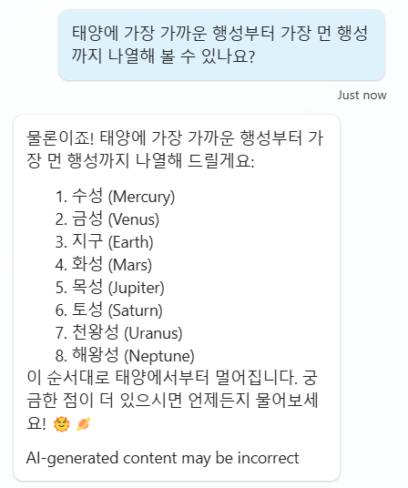

# AI general knowledge AI 일반 지식

지식 소스 외에도 AI 일반 지식을 사용하여 고객의 질문에 대한 정보를 찾아
제공할 수 있습니다. 일반 지식을 사용하면 고객의 모든 질문을 다루지 못할
수 있는 여러 주제를 수동으로 작성할 필요가 없습니다. 이 기능을 통해
코파일럿이 지식 소스의 데이터를 기반으로 하지 않고도 자체 지식을
사용하여 질문에 답변할 수 있습니다. 이는 ChatGPT에게 질문하는 것과
유사합니다.

## Task 1: AI 일반 지식 사용 구성

1. 상단메뉴에 **Overview** 탭으로 이동합니다.

2. **Knowledge** 영역에서 **\"Allow the AI to use its own general knowledge\"** 을 활성화합니다.

   

## Task 2: AI 일반 지식 사용 테스트

1.  **Test** 창을 엽니다.

2.  기존 주제나 구성된 지식 소스와 일치하지 않는 질문을 합니다.

    ```
    태양에 가장 가까운 행성부터 가장 먼 행성까지 나열해 볼 수 있나요?
    ```

    
