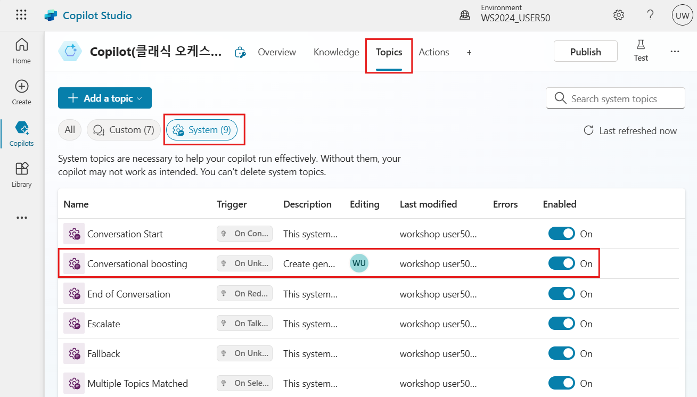
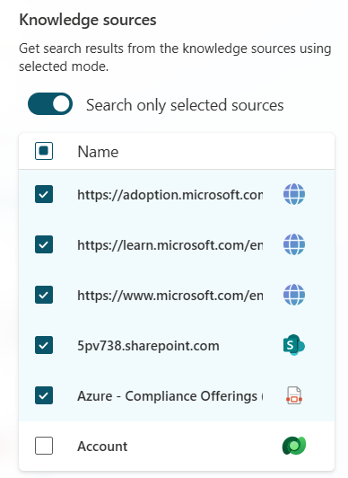
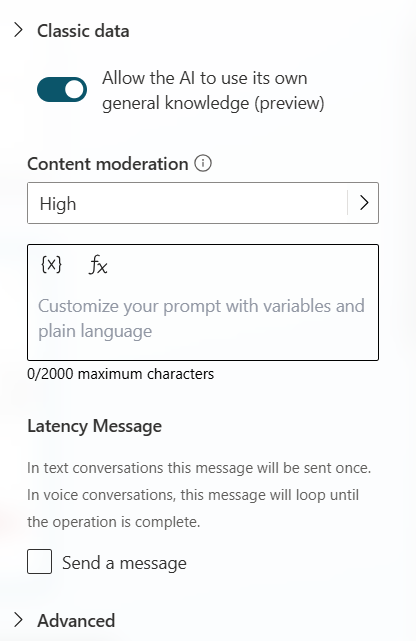
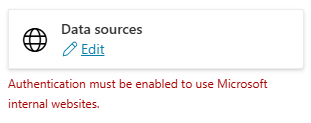

# 대화 증진(Conversational boosting) 토픽과 생성형 응답 노드

기본 내장된 자연어 이해 모델을 사용하면 토픽을 트리거하지 않는 모든 사용자 발화가 대화 증진 토픽으로 이동하며, 답변이 식별되지 않으면 폴백으로 이동합니다.  
다른 토픽과 마찬가지로 대화 증진 토픽의 논리를 시나리오에 맞게 구성할 수 있습니다.

## Task 1: 대화 증진 토픽 접근

1. 상단메뉴에서 **Topics** 탭으로 이동합니다.

2. **System** 토픽 영역을 선택합니다.

3. **Conversational boosting** 토픽을 선택합니다.

    

## Task 2: 생성형 응답 노드 검토

1.  대화 증진 토픽에서 생성형 응답 노드 속성으로 이동합니다.

2.  **Search only selected sources**을 설정하면 해당 노드에 들어갈 때 사용해야 하는 지식 소스를 직접 선택할 수 있습니다.

3.  예를 들어, Dataverse 지식 소스를 제외한 나머지 모든 소스를 선택합니다.

   

4.  AI가 자체 일반 지식을 사용하지 않도록 (**Allow the AI to use its own general knowledge(preview)**)를 설정할 수도 있으며, 추가 맞춤형 지시 사항을 설정할 수도 있습니다.  
    콘텐츠 중재 설정은 코파일럿이 잘못된 답변을 생성하는 것을 방지하기 위해 적용할 제어 수준입니다  
    (예: 데이터를 잘못 해석하거나 과도하게 해석하여 질문에 대한 잘못된 답변을 생성하는 경우).

    
    
5.  **Save** 합니다.

**Pro tip:** 이 랩에서 수행된 테스트에는 적용되지 않으므로 인증 경고는 무시할 수 있습니다.
    

