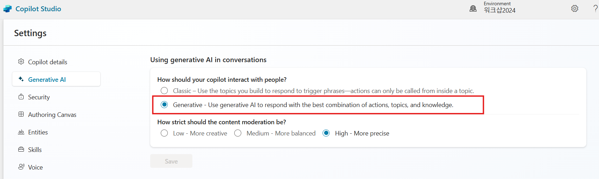
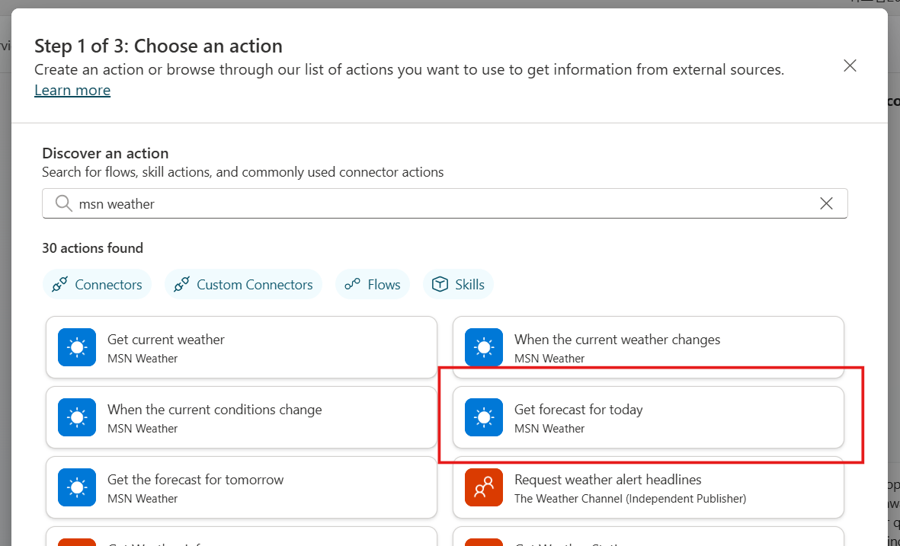
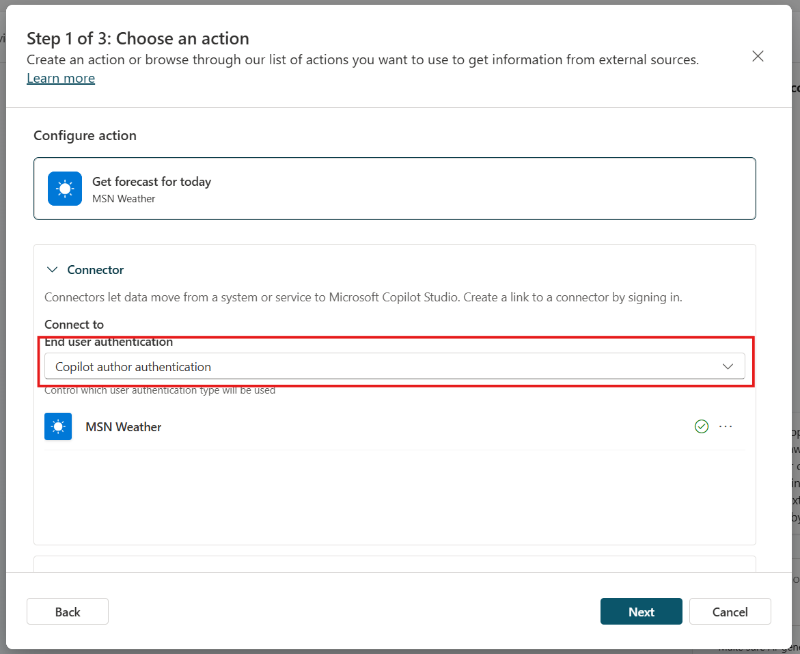
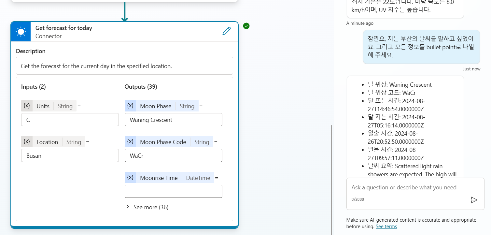

# 생성형 AI 오케스트레이션

기본적으로 코파일럿은 사용자의 쿼리와 가장 잘 일치하는 트리거 문구를 가진 토픽을 트리거하고 대화 컨텍스트에서 토픽 입력을 채워 응답합니다.
생성형 AI를 사용하여 코파일럿이 생성한 질문으로 값을 요청함으로써 대화 컨텍스트뿐만 아니라 토픽 입력을 채울 수도 있습니다. 
이 동작 및 이를 관리하는 방법에 대해 더 알아보려면 \'토픽 입력 및 출력 관리\'를 참조하십시오.

생성형 AI를 사용하여 코파일럿이 응답하는 방식을 결정하면 사용자에게 더 자연스럽고 유동적인 대화를 제공할 수 있습니다. 
사용자가 메시지를 보내면 코파일럿은 응답을 준비하기 위해 하나 이상의 작업 또는 토픽을 선택합니다.
선택은 여러 요소에 따라 결정됩니다. 
가장 중요한 요소는 토픽 및 작업에 대한 설명입니다. 
다른 요소로는 토픽이나 작업의 이름, 입력 또는 출력 매개변수, 이름 및 설명 등이 있습니다. 
설명은 코파일럿이 사용자의 의도를 작업 및 토픽과 더 정확하게 연관시킬 수 있게 합니다.

생성 모드에서 코파일럿은 다중 의도 쿼리를 처리하기 위해 여러 작업 또는 토픽을 동시에 선택할 수 있습니다. 
작업 및 토픽이 선택되면 코파일럿은 실행 순서를 결정하는 계획을 생성합니다.

Copilot Studio에서 생성 모드를 사용하는 코파일럿을 테스트할 때 대화 맵을 열어 계획 실행을 따라갈 수 있습니다.

## Task 1: 생성형 AI 오케스트레이션 활성화

기본 언어가 한국어인 경우, 생성형 AI 옵션을 활성화 할 수 없습니다.
이 경우, 새로운 코파일럿을 생성해서 진행해 주세요. 

1.  **Settings** 로  이동하여 **Generative AI**  옵션을 선택합니다.

2.  **\"How should your copilot interact with people?\"** 에서 **\"Generative\"** 를 선택한 다음 저장합니다.
   
   

# Actions 

생성 모드를 활성화하면 코파일럿은 런타임에 사용자의 요청에 가장 적합한 작업 또는 토픽을 자동으로 선택할 수 있습니다. 

클래식 모드에서는 코파일럿이 토픽에 정해진 메세지를 통해서만 사용자에게 응답할 수 있습니다. 

그러나 토픽 내에서 Action을 명시적으로 호출하도록 코파일럿을 설계할 수 있습니다.

Action은 다음 기본 작업 유형 중 하나를 기반으로 합니다:

-   사전 빌드된 커넥터 작업
-   맞춤형 커넥터 작업
-   Power Automate 클라우드 흐름
-   AI Builder 프롬프트
-   Bot Framework 스킬

각 기본 Action은 Action을 수행하기 위해 필요한 입력을 채우기 위해 질문을 생성하도록 생성형 AI를 사용할 수 있게 하는 추가 정보를 가지고 있습니다.
따라서 흐름에서 필요한 입력과 같은 모든 입력을 수집하기 위해 질문 노드를 수동으로 작성할 필요가 없습니다. 
입력은 런타임 동안 처리됩니다.

Action은 Action의 결과를 사용하여 사용자의 쿼리에 대한 컨텍스트 응답을 생성할 수 있습니다. 
또는 Action에 대한 응답을 명시적으로 작성할 수 있습니다.

## Task 1: Action 생성

1.  상단메뉴에서 **Actions** 탭으로 이동합니다.

2.  **Add an action**를 선택합니다.

3.  오늘의 예보를 가져오는 커넥터를 선택합니다. 아래 검색어로 검색합니다.

    ```
    Get forecast for today
    ```

    

4.  연결이 자동으로 생성될 때까지 기다립니다.

5.  스크롤하여 **End user authentication** 에서 **Copilot author authentication**을 선택합니다. 
    이렇게 하면 날씨 커넥터를 사용할 때 최종 사용자 연결을 사용하지 않고 코파일럿이 작동할 수 있습니다. 
    대신 작성자가 설정한 연결이 사용됩니다.
    다른 속성은 그대로 둡니다.
    
    

6.  **Next**를 클릭합니다.

7.  **Edit inputs**을 선택합니다.

8.  **Location** 입력은 그대로 두고, **Units** 입력에 대해 **How will the copilot fill this input?** 에서 **Set as a value**를 선택합니다.

9.  **Value**에 **C**를 선택합니다.

    

10. **Save**을 선택한 다음 **Next**을 선택합니다.

11. 구성을 검토하고 **Finish**를 선택합니다.

## Task 2: Test your action 작업 2: 작업 테스트

1.  **Test** 창으로 이동합니다.

2.  질문을 합니다.

   ```
   날씨가 어떤가요?
   ```

3.  테스트 창에서 **Conversation map**을 클릭하여 코파일럿이 질문을 해석하고 응답을 준비하는 방법을 확인합니다.

   

4.  도시 이름으로 응답합니다.

   ```
   서울
   ```


5. 코파일럿이 자동으로 입력을 해당 도시로 업데이트하고 응답을 제공하는 것을 확인합니다.

6.  봇에게 실수를 알리고 쿼리를 변경합니다.

   ```
   잠깐요, 저는 부산의 날씨를 말하고 싶었어요. 그리고 모든 정보를 bullet point로 나열해 주세요.
   ```

   

8.  코파일럿이 커넥터에 대한 쿼리를 업데이트하고, 모든 이용 가능한 정보를 목록으로 나열하는 지시 사항에 따라 응답하는 것을 확인합니다.

# Summary 요약

실습 6 \'연결기와 상호작용하기 위한 생성형 AI 오케스트레이션 사용\'을
완료해 주셔서 감사합니다. 여러분은 다음 작업을 성공적으로 완료했습니다.

-   Copilot Studio에서 작업 생성
-   Copilot Studio에서 사용자에게 동적 데이터 표시
-   대화 컨텍스트를 활용하여 후속 질문
