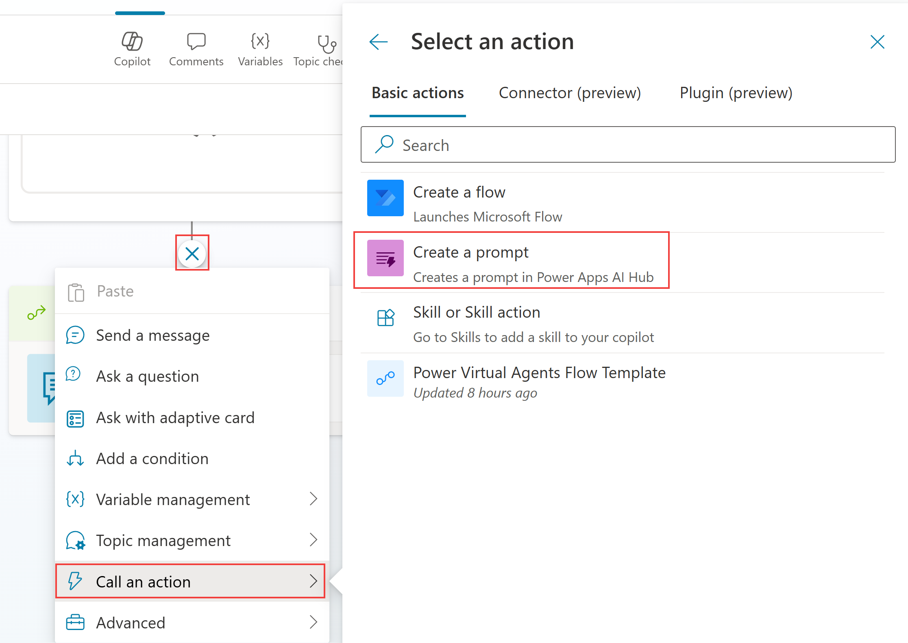
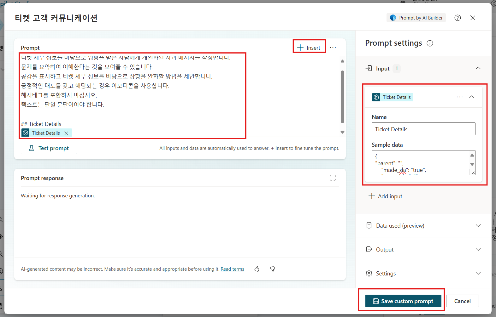
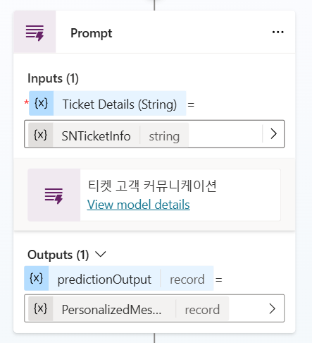
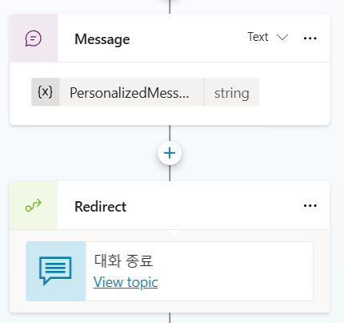
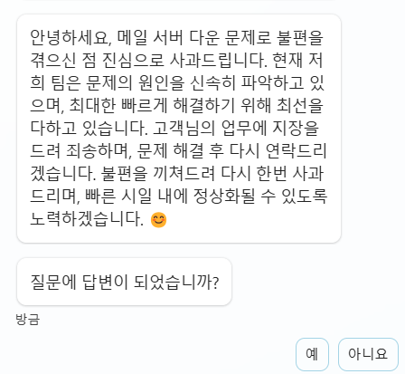

# AI Builder 프롬프트

프롬프트를 LLM(Large Language Model)에게 주는 작업이나 목표로
생각하십시오. 프롬프트 빌더를 사용하면 맞춤형 프롬프트를 만들고
테스트하며 저장할 수 있습니다. 또한 런타임 시 동적 컨텍스트 데이터를
제공하는 입력 변수를 사용할 수 있습니다. 이러한 프롬프트를 다른 사람들과
공유하고 Power Automate, Power Apps 또는 Copilot Studio에서 사용할 수
있습니다. 예를 들어, 회사 이메일에서 작업 항목을 선택하는 프롬프트를
만들어 이메일 처리 자동화를 구축하는 Power Automate 플로우에서 사용할 수
있습니다.

프롬프트 빌더는 메이커가 자연어를 사용하여 특정 비즈니스 요구에 맞는
맞춤형 프롬프트를 고안할 수 있도록 합니다. 이러한 프롬프트는 콘텐츠
요약, 데이터 분류, 엔티티 추출, 언어 번역, 감정 평가 또는 불만에 대한
응답 작성 등 다양한 작업이나 비즈니스 시나리오에 사용할 수 있습니다

프롬프트를 플로우에 통합하여 지능형 자동화를 구축할 수 있습니다.
메이커는 자연어 프롬프트를 설명하여 애플리케이션의 고급 생성 AI 기능을
구축할 수 있습니다. 이러한 프롬프트를 사용하여 맞춤형 Copilot을
확장함으로써 일상적인 비즈니스 운영을 간소화하고 효율성을 높일 수
있습니다.

맞춤형 프롬프트를 사용하면 메이커는 GPT 모델이 특정 방식으로 작동하거나
특정 작업을 수행하도록 지시할 수 있습니다. 프롬프트를 신중하게
작성함으로써 특정 비즈니스 요구에 맞는 응답을 생성할 수 있습니다. 이를
통해 GPT 모델을 다양한 작업을 수행할 수 있는 유연한 도구로 변환할 수
있습니다.

## Task 1: 생성 AI 오케스트레이션 비활성화

1.  **Settings** 으로 이동하여 **Generative AI** 를 선택하십시오.

2.  **\"How should your copilot interact with people?\"** 에서 **Classic** 을 선택한 후 저장하십시오.

## Task 2: 프롬프트 생성

1.  **Topics**로 이동하여 **\"티켓 상태 확인\"** 을 엽니다.

2. 적응형 카드가 포함된 마지막 메시지 뒤에 **(+)** 버튼으로 다른 노드를 추가합니다.
**Call an action**을 선택하고 **Create a prompt**을 선택합니다.

    

3.  다음과 같이 이름을 정합니다.
    ```
    티켓 고객 커뮤니케이션
    ```

4.  **Add Input**을 클릭하고, **Name** 에 아래 이름을 입력합니다.
    ```
    Ticket Details
    ```

5.  **Prompt**에 아래 지침을 복사하여 붙여넣기합니다.

    ```
    티켓 세부 정보를 바탕으로 영향을 받은 사람에게 개인화된 사과 메시지를 작성합니다.
    문제를 요약하여 이해한다는 것을 보여줄 수 있습니다.
    공감을 표시하고 티켓 세부 정보를 바탕으로 상황을 완화할 방법을 제안합니다.
    긍정적인 태도를 갖고 해당되는 경우 이모티콘을 사용합니다.
    해시태그를 포함하지 마십시오.
    텍스트는 단일 문단이어야 합니다.
    
    ## Ticket details
    ```


6.  Ticket details 아래에 **Insert** 버튼을 사용하여 **Ticket details**을 선택하십시오.
   
7.  **Settings**에서 모델 **GPT 4o** 를 선택하십시오.
    
8.  랩 3에서 ServiceNow 샘플 JSON 페이로드를 **Input** - **Sample data** 에 붙여넣고 **Test Prompt** 를 선택하여 프롬프트를 테스트하십시오.

      

     ```
     {
        "parent": "",
        "made_sla": "true",
        "caused_by": "",
        "watch_list": "",
        "upon_reject": "Cancel all future Tasks",
        "sys_updated_on": "2018-12-12 23:18:55",
        "child_incidents": "0",
        "hold_reason": "",
        "origin_table": "",
        "task_effective_number": "INC0009005",
        "approval_history": "",
        "number": "INC0009005",
        "resolved_by": "",
        "sys_updated_by": "admin",
        "opened_by": "System Administrator",
        "user_input": "",
        "sys_created_on": "2018-08-31 21:35:45",
        "sys_domain": "global",
        "state": "New",
        "route_reason": "",
        "sys_created_by": "admin",
        "knowledge": "false",
        "order": "",
        "calendar_stc": "",
        "closed_at": "",
        "cmdb_ci": "",
        "delivery_plan": "",
        "contract": "",
        "impact": "1 - High",
        "active": "true",
        "work_notes_list": "",
        "business_service": "",
        "business_impact": "",
        "priority": "1 - Critical",
        "sys_domain_path": "/",
        "rfc": "",
        "time_worked": "",
        "expected_start": "",
        "opened_at": "2018-08-31 21:35:21",
        "business_duration": "",
        "group_list": "",
        "work_end": "",
        "caller_id": "David Miller",
        "reopened_time": "",
        "resolved_at": "",
        "approval_set": "",
        "subcategory": "Email",
        "work_notes": "2018-12-12 23:18:42 - System Administrator (Work notes)\nupdated the priority to high based on the criticality of the Incident.\n\n",
        "universal_request": "",
        "short_description": "Email server is down.",
        "correlation_display": "",
        "delivery_task": "",
        "work_start": "",
        "assignment_group": "",
        "additional_assignee_list": "",
        "business_stc": "",
        "cause": "",
        "description": "Unable to send or receive emails.",
        "origin_id": "",
        "calendar_duration": "",
        "close_notes": "",
        "notify": "Do Not Notify",
        "service_offering": "",
        "sys_class_name": "Incident",
        "closed_by": "",
        "follow_up": "",
        "parent_incident": "",
        "sys_id": "ed92e8d173d023002728660c4cf6a7bc",
        "reopened_by": "",
        "incident_state": "New",
        "urgency": "1 - High",
        "problem_id": "",
        "company": "",
        "reassignment_count": "0",
        "activity_due": "2018-12-13 01:18:55",
        "assigned_to": "",
        "severity": "3 - Low",
        "comments": "",
        "approval": "Not Yet Requested",
        "sla_due": "UNKNOWN",
        "comments_and_work_notes": "2018-12-12 23:18:42 - System Administrator (Work notes)\nupdated the priority to high based on the criticality of the Incident.\n\n",
        "due_date": "",
        "sys_mod_count": "3",
        "reopen_count": "0",
        "sys_tags": "",
        "escalation": "Normal",
        "upon_approval": "Proceed to Next Task",
        "correlation_id": "",
        "location": "",
        "category": "Software"
     }
     ```

9.  **Save custome prompt**을 선택하여 저장하고, 저장된 후에 **Cancel**을 클릭해서 팝업화면을 닫습니다. 

    프롬프트가 추가되지 않은 경우, 다시 **+** 버튼을 누르고, **Call an action**을 선택한 후, **티켓 고객 커뮤니케이션**을 선택하여 추가합니다.

10. **Ticket Details** 에 **SNTicketInfo** 변수를 선택하십시오.

11. 생성된 출력물을 위한 변수를 아래의 이름으로 생성하십시오. 

    ```
    PersonalizedMessage
    ```

    

12. 메시지 노드를 추가하고 PersonalizedMessage.text 변수를 삽입하십시오.

    

13. **Save**를 클릭합니다.

14. **Test**를 눌러 테스트합니다.

    ```
    티켓 INC0008111의 대한 최신 정보는 무엇입니까?
    ```

    

# Summary 요약

랩 07 '생성 AI 오케스트레이션을 사용하여 커넥터와 상호 작용하기'를 완료해 주셔서 감사합니다. 다음 작업을 성공적으로 완료하셨습니다.

- Copilot Studio에서 맞춤형 프롬프트 생성 
- 입력을 전달하고 출력물을 최종 사용자에게 제공하는 답변으로 사용
